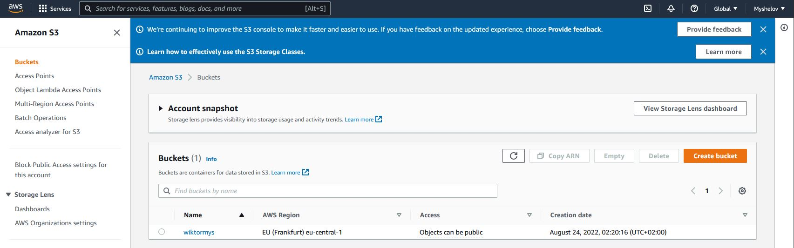

# Репозиторий для домашних заданий по курсу DevOps
###### 7.5  
## ДЗ 7.5 
#### Основы golang.
*С `golang` в рамках курса, мы будем работать не много, поэтому можно использовать любой IDE. 
Но рекомендуем ознакомиться с [GoLand](https://www.jetbrains.com/ru-ru/go/).*   

1. *Установите golang.*  
   1. *Воспользуйтесь инструкций с официального сайта: [https://golang.org/](https://golang.org/).*  
   2. *Так же для тестирования кода можно использовать песочницу: [https://play.golang.org/](https://play.golang.org/).*  
```bash
[user@DESKTOP-KCS3IDD DevOps-netology]$ go version
go version go1.17.12 linux/amd64
```  

2. *Знакомство с gotour.*  
*У Golang есть обучающая интерактивная консоль [https://tour.golang.org/](https://tour.golang.org/). 
Рекомендуется изучить максимальное количество примеров. В консоли уже написан необходимый код, 
осталось только с ним ознакомиться и поэкспериментировать как написано в инструкции в левой части экрана.*  

3. *Написание кода.*   
*Цель этого задания закрепить знания о базовом синтаксисе языка. Можно использовать редактор кода 
на своем компьютере, либо использовать песочницу: [https://play.golang.org/](https://play.golang.org/).*

   1. *Напишите программу для перевода метров в футы (1 фут = 0.3048 метр). Можно запросить исходные данные 
у пользователя, а можно статически задать в коде.*  
    *Для взаимодействия с пользователем можно использовать функцию `Scanf`:*  
   ```
    package main
    
    import "fmt"
    
    func main() {
        fmt.Print("Enter a number: ")
        var input float64
        fmt.Scanf("%f", &input)
    
        output := input * 2
    
        fmt.Println(output)    
    }
   ```  
**Ответ:**  
```bash
package main

import "fmt"

func multi(m float64)(f float64) {
    f = m * 3.281
    return
}

func main() {
    fmt.Print("Enter meters: ")
    var meters float64
    fmt.Scanf("%f", &meters)

    output := multi(meters)
    fmt.Println("Footage:", output)
}
```  
```bash
[user@DESKTOP-KCS3IDD 07-terraform-05-golang]$ go run job1.go
Enter meters: 1
Footage: 3.281
```  
 
2. *Напишите программу, которая найдет наименьший элемент в любом заданном списке, например:*  
    ```
    x := []int{48,96,86,68,57,82,63,70,37,34,83,27,19,97,9,17,}
    ```  
**Ответ:**  
```bash
package main

import "fmt"
import "sort"

func MinNum (toSort []int)(minNum int) {
	sort.Ints(toSort)
	minNum = toSort[0]
	return
}

func main() {
	x := []int{48,96,86,68,57,82,63,70,37,34,83,27,19,97,9,17,}
	y := MinNum(x)
	fmt.Println("Min number:", y)
}
```  
```bash
[user@DESKTOP-KCS3IDD 07-terraform-05-golang]$ go run job2.go
Min number: 9
```
3. *Напишите программу, которая выводит числа от 1 до 100, которые делятся на 3.  
То есть `(3, 6, 9, …)`.*  

**Ответ:**  
```bash
package main

import (
    "fmt"
    "strconv"
    "strings"
)

func NumSel ()(s []int) {
	for i := 1;  i <= 100; i ++ {
		if	i % 3 == 0 {
			s = append(s, i)
		}
	}
	return
}

func main() {
	Result1 := NumSel()

    // The int slice we are converting to a string.
    values := Result1
    valuesText := []string{}

    // Create a string slice using strconv.Itoa.
    // ... Append strings to it.
    for i := range values {
        number := values[i]
        text := strconv.Itoa(number)
        valuesText = append(valuesText, text)
    }

    // Join our string slice.
    Result2 := strings.Join(valuesText, ", ")
    fmt.Println("Numbers may be divided into 3: ("+Result2+")")
}
```  
```bash
[user@DESKTOP-KCS3IDD 07-terraform-05-golang]$ go run job3.go
Numbers may be divided into 3: (3, 6, 9, 12, 15, 18, 21, 24, 27, 30, 33, 36, 39, 42, 45, 48, 51, 54, 57, 60, 63, 66, 69, 72, 75, 78, 81, 84, 87, 90, 93, 96, 99)
```  
В виде решения ссылку на код или сам код. 
4. *Протестировать код (не обязательно).*  
*Создайте тесты для функций из предыдущего задания.*   
  
**Ответ:**  
```bash
package main
import "testing"
func TestMain(t *testing.T) {
	var v float64
	v = multi(1)
	if v != 3.281 {
		t.Error("Pending 3.281, received ", v)
	}
}
```  
```bash
[user@DESKTOP-KCS3IDD 07-terraform-05-golang]$ go test job1.go job1_test.go
ok      command-line-arguments  0.002s
```  
```bash
package main
import "testing"
func TestMain(t *testing.T) {
	var v int
	v = MinNum([]int{48,96,86,68,57,82})
	if v != 48 {
		t.Error("Pending 48, received ", v)
	}
}
```  
```bash
[user@DESKTOP-KCS3IDD 07-terraform-05-golang]$ go test job2.go job2_test.go
ok      command-line-arguments  0.002s
```  
```bash
package main
import "fmt"
import "testing"
func TestMain(t *testing.T) {
	var v []int
	v = NumSel()
	if v[5] != 18 || v[20] != 63 || v[25] != 78 {
		s := fmt.Sprintf("Pending 18 and 64 and 78, received %v and %v and %v", v[5], v[20], v[25])
		t.Error(s)
	}
}
```
```bash
[user@DESKTOP-KCS3IDD 07-terraform-05-golang]$ go test job3.go job3_test.go
ok      command-line-arguments  0.002s
```

###### 7.3  
## ДЗ 7.3 
#### Основы Terraform.  
#### 1. *Создадим бэкэнд в S3 (необязательно, но крайне желательно).*  
*Если в рамках предыдущего задания у вас уже есть аккаунт AWS, то давайте продолжим знакомство со взаимодействием
терраформа и aws.*   

1. *Создайте s3 бакет, iam роль и пользователя от которого будет работать терраформ. Можно создать отдельного пользователя,
а можно использовать созданного в рамках предыдущего задания, просто добавьте ему необходимы права, как описано 
[здесь](https://www.terraform.io/docs/backends/types/s3.html).*  
2. *Зарегистрируйте бэкэнд в терраформ проекте как описано по ссылке выше.*   
```bash
[user@DESKTOP-KCS3IDD terraform]$ aws s3api create-bucket \
>     --bucket wiktormys \
>     --region eu-central-1 \
>     --object-ownership BucketOwnerEnforced \
>     --create-bucket-configuration LocationConstraint=eu-central-1
{
    "Location": "http://wiktormys.s3.amazonaws.com/"
}

```   
```bash
[user@DESKTOP-KCS3IDD terraform]$ aws s3 ls
2022-08-24 02:20:16 wiktormys
```  


#### 2. *Инициализируем проект и создаем воркспейсы.*  
1. *Выполните `terraform init`:*  
    * *если был создан бэкэнд в S3, то терраформ создаст файл стейтов в S3 и запись в таблице 
dynamodb.*  
    * *иначе будет создан локальный файл со стейтами.*    
2. *Создайте два воркспейса `stage` и `prod`.*  
3. *В уже созданный `aws_instance` добавьте зависимость типа инстанса от вокспейса, что бы в разных ворскспейсах 
использовались разные `instance_type`.*  
4. *Добавим `count`. Для `stage` должен создаться один экземпляр `ec2`, а для `prod` два.*   
5. *Создайте рядом еще один `aws_instance`, но теперь определите их количество при помощи `for_each`, а не `count`.*  
6. *Что бы при изменении типа инстанса не возникло ситуации, когда не будет ни одного инстанса добавьте параметр
жизненного цикла `create_before_destroy = true` в один из ресурсов `aws_instance`.*  
7. *При желании поэкспериментируйте с другими параметрами и ресурсами.*  
*В виде результата работы пришлите:*  
* *Вывод команды `terraform workspace list`.*  
* *Вывод команды `terraform plan` для воркспейса `prod`.*  
```bash
[user@DESKTOP-KCS3IDD terraform]$ terraform workspace new stage
Created and switched to workspace "stage"!

You're now on a new, empty workspace. Workspaces isolate their state,
so if you run "terraform plan" Terraform will not see any existing state
for this configuration.
```  
```bash
[user@DESKTOP-KCS3IDD terraform]$ terraform workspace new prod
Created and switched to workspace "prod"!

You're now on a new, empty workspace. Workspaces isolate their state,
so if you run "terraform plan" Terraform will not see any existing state
for this configuration.
```  
```bash
[user@DESKTOP-KCS3IDD terraform]$ terraform workspace list
  default
* prod
  stage
```  

[terraform config files](https://github.com/WiktorMysz/devops-netology/tree/main/Terraform/7.3)
```bash
[user@DESKTOP-KCS3IDD terraform]$ terraform plan -no-color > terraform_plan.txt
```  
[terraform plan для `prod`](https://github.com/WiktorMysz/devops-netology/tree/main/Terraform/7.3/terraform_plan)


###### 7.2  
## ДЗ 7.2 
#### Облачные провайдеры и синтаксис Terraform.  
*Зачастую разбираться в новых инструментах гораздо интересней понимая то, как они работают изнутри. Поэтому в рамках первого необязательного задания предлагается завести свою учетную запись в AWS (Amazon Web Services) или Yandex.Cloud. Идеально будет познакомится с обоими облаками, потому что они отличаются.*  
#### 1. *(вариант с AWS). Регистрация в aws и знакомство с основами (необязательно, но крайне желательно).*  
*Остальные задания можно будет выполнять и без этого аккаунта, но с ним можно будет увидеть полный цикл процессов.*  

*AWS предоставляет достаточно много бесплатных ресурсов в первый год после регистрации, подробно описано [здесь](https://aws.amazon.com/free/).*  
1. *Создайте аккаут aws.*  
2. *Установите c aws-cli https://aws.amazon.com/cli/.*  
3. *Выполните первичную настройку aws-sli https://docs.aws.amazon.com/cli/latest/userguide/cli-configure-quickstart.html.*  
4. *Создайте IAM политику для терраформа c правами*  
    * AmazonEC2FullAccess  
    * AmazonS3FullAccess  
    * AmazonDynamoDBFullAccess  
    * AmazonRDSFullAccess  
    * CloudWatchFullAccess  
    * IAMFullAccess  
5. *Добавьте переменные окружения*  
    ```
    export AWS_ACCESS_KEY_ID=(your access key id)
    export AWS_SECRET_ACCESS_KEY=(your secret access key)
    ```
6. *Создайте, остановите и удалите ec2 инстанс (любой с пометкой `free tier`) через веб интерфейс.*   

*В виде результата задания приложите вывод команды `aws configure list`.*  

```bash
[user@DESKTOP-KCS3IDD terraform]$ aws configure list
      Name                    Value             Type    Location
      ----                    -----             ----    --------
   profile                <not set>             None    None
access_key     ****************UOPH              env
secret_key     ****************R4ee              env
    region             eu-central-1      config-file    ~/.aws/config
```  
#### 1. *(Вариант с Yandex.Cloud). Регистрация в ЯО и знакомство с основами (необязательно, но крайне желательно).*  
1. *Подробная инструкция на русском языке содержится [здесь](https://cloud.yandex.ru/docs/solutions/infrastructure-management/terraform-quickstart).*  
2. *Обратите внимание на период бесплатного использования после регистрации аккаунта.*  
3. *Используйте раздел "Подготовьте облако к работе" для регистрации аккаунта. Далее раздел "Настройте провайдер" для подготовки
базового терраформ конфига.*  
4. *Воспользуйтесь [инструкцией](https://registry.terraform.io/providers/yandex-cloud/yandex/latest/docs) на сайте терраформа, что бы 
не указывать авторизационный токен в коде, а терраформ провайдер брал его из переменных окружений.*  

```bash
% yc config list
token: XXXXXXXXXXXXXXXXXXXXXXXXXXXX
cloud-id: b1gf414nutkriug2ir4g
folder-id: b1g6362m5m9e57sur9d1
compute-default-zone: ru-central1-a
```

#### 2. Создание aws ec2 или yandex_compute_instance через терраформ.

1. *В каталоге `terraform` вашего основного репозитория, который был создан в начале курсе, создайте файл `main.tf` и `versions.tf`.*
2. *Зарегистрируйте провайдер*  
   1. *для [aws](https://registry.terraform.io/providers/hashicorp/aws/latest/docs). В файл `main.tf` добавьте
   блок `provider`, а в `versions.tf` блок `terraform` с вложенным блоком `required_providers`. Укажите любой выбранный вами регион 
   внутри блока `provider`.*  
   2. *либо для [yandex.cloud](https://registry.terraform.io/providers/yandex-cloud/yandex/latest/docs). Подробную инструкцию можно найти 
   [здесь](https://cloud.yandex.ru/docs/solutions/infrastructure-management/terraform-quickstart).*  
3. *Внимание! В гит репозиторий нельзя пушить ваши личные ключи доступа к аккаунту. Поэтому в предыдущем задании мы указывали
их в виде переменных окружения.*   
4. *В файле `main.tf` воспользуйтесь блоком `data "aws_ami` для поиска ami образа последнего Ubuntu.*    
5. *В файле `main.tf` создайте рессурс*   
   1. *либо [ec2 instance](https://registry.terraform.io/providers/hashicorp/aws/latest/docs/resources/instance).
   Постарайтесь указать как можно больше параметров для его определения. Минимальный набор параметров указан в первом блоке 
   `Example Usage`, но желательно, указать большее количество параметров.*  
   2. *либо [yandex_compute_image](https://registry.terraform.io/providers/yandex-cloud/yandex/latest/docs/resources/compute_image).*  
6. *Также в случае использования aws:*  
   1. *Добавьте data-блоки `aws_caller_identity` и `aws_region`.*  
   2. *В файл `outputs.tf` поместить блоки `output` с данными об используемых в данный момент:*   
       * AWS account ID,  
       * AWS user ID,  
       * AWS регион, который используется в данный момент,   
       * Приватный IP ec2 инстансы,  
       * Идентификатор подсети в которой создан инстанс.    
7. *Если вы выполнили первый пункт, то добейтесь того, что бы команда `terraform plan` выполнялась без ошибок.*   
```bash
Plan: 4 to add, 0 to change, 0 to destroy.
Changes to Outputs:
  + aws_account_id     = "341635784912"
  + aws_net_private_ip = (known after apply)
  + aws_net_subnet_id  = (known after apply)
  + aws_region         = "ec2.eu-central-1.amazonaws.com"
  + aws_user_id        = "341635784912"
  + yandex_ip_private  = (known after apply)
  + yandex_vpc_subnet  = (known after apply)
  + yandex_zone        = (known after apply)
Do you want to perform these actions?
  Terraform will perform the actions described above.
  Only 'yes' will be accepted to approve.
  Enter a value: yes
yandex_vpc_network.net: Creating...
aws_instance.ubuntu: Creating...
yandex_vpc_network.net: Creation complete after 2s [id=enp47smttn2udbms24f0]
yandex_vpc_subnet.subnet: Creating...
yandex_vpc_subnet.subnet: Creation complete after 1s [id=e9b3vbi9ncq3hbttises]
yandex_compute_instance.vm: Creating...
aws_instance.ubuntu: Still creating... [10s elapsed]
yandex_compute_instance.vm: Still creating... [10s elapsed]
aws_instance.ubuntu: Creation complete after 15s [id=i-02e18ceb6723c46c1]
yandex_compute_instance.vm: Still creating... [20s elapsed]
yandex_compute_instance.vm: Creation complete after 26s [id=fhmasuhme4q3arja4fp9]
Apply complete! Resources: 4 added, 0 changed, 0 destroyed.
Outputs:
aws_account_id = "341635784912"
aws_net_private_ip = "172.31.4.27"
aws_net_subnet_id = "subnet-0adf4bba656b2a0b2"
aws_region = "ec2.eu-central-1.amazonaws.com"
aws_user_id = "341635784912"
yandex_ip_private = "10.2.0.7"
yandex_vpc_subnet = "e9b3vbi9ncq3hbttises"
yandex_zone = "ru-central1-a"
```


В качестве результата задания предоставьте:
1. Ответ на вопрос: при помощи какого инструмента (из разобранных на прошлом занятии) можно создать свой образ ami?
[Packer](https://www.packer.io/)
2. Ссылку на репозиторий с исходной конфигурацией терраформа.
[terraform](https://github.com/WiktorMysz/devops-netology/tree/main/Terraform/7.2)

###### 7.1  
## ДЗ 7.1 
#### Инфраструктура как код  
1. *Выбор инструментов.*  
#### Легенда
 
*Через час совещание на котором менеджер расскажет о новом проекте. Начать работу над которым надо 
будет уже сегодня. На данный момент известно, что это будет сервис, который ваша компания будет предоставлять внешним заказчикам.
Первое время, скорее всего, будет один внешний клиент, со временем внешних клиентов станет больше.*  

*Так же по разговорам в компании есть вероятность, что техническое задание еще не четкое, что приведет к большому
количеству небольших релизов, тестированию интеграций, откатов, доработок, то есть скучно не будет.*   
   
*Вам, как девопс инженеру, будет необходимо принять решение об инструментах для организации инфраструктуры.
На данный момент в вашей компании уже используются следующие инструменты:*  
- *остатки Сloud Formation,*  
- *некоторые образы сделаны при помощи Packer,*  
- *год назад начали активно использовать Terraform,*  
- *разработчики привыкли использовать Docker,*  
- *уже есть большая база Kubernetes конфигураций,*   
- *для автоматизации процессов используется Teamcity,*   
- *также есть совсем немного Ansible скриптов,*   
- *и ряд bash скриптов для упрощения рутинных задач.*    

*Для этого в рамках совещания надо будет выяснить подробности о проекте, что бы в итоге определиться с инструментами:*  

1. *Какой тип инфраструктуры будем использовать для этого проекта: изменяемый или не изменяемый?*  

**Ответ:**  
```bash
Неизменяемый.
```
2. Будет ли центральный сервер для управления инфраструктурой?

**Ответ:**  
```bash
Нет. Управление будет с любой машины через Terraform/Ansible и Git.
```

**Ответ:**  
3. Будут ли агенты на серверах?

**Ответ:**  
```bash
Нет. Используем agentless Ansible.
```

4. Будут ли использованы средства для управления конфигурацией или инициализации ресурсов? 

**Ответ:**  
```bash
Да. Terraform/Ansible.
```
 
*В связи с тем, что проект стартует уже сегодня, в рамках совещания надо будет определиться со всеми этими вопросами.*  

#### *В результате задачи необходимо*

1. *Ответить на четыре вопроса представленных в разделе "Легенда".*   
2. *Какие инструменты из уже используемых вы хотели бы использовать для нового проекта?*   

**Ответ:**  
```bash
Terraform, Ansible, Packer, Docker, Kubernetes
```
3. Хотите ли рассмотреть возможность внедрения новых инструментов для этого проекта?
```bash
Можно использовать GitLab CI/CD
```

Если для ответа на эти вопросы недостаточно информации, то напишите, какие моменты уточните на совещании.


#### Задача 2. Установка терраформ.

Официальный сайт: https://www.terraform.io/

Установите терраформ при помощи менеджера пакетов используемого в вашей операционной системе.
В виде результата этой задачи приложите вывод команды `terraform --version`.

```bash
[user@DESKTOP-KCS3IDD vagrant]$ terraform --version
Terraform v1.2.2
on linux_amd64 
```

#### Задача 3. Поддержка легаси кода.

В какой-то момент вы обновили терраформ до новой версии, например с 0.12 до 0.13. 
А код одного из проектов настолько устарел, что не может работать с версией 0.13. 
В связи с этим необходимо сделать так, чтобы вы могли одновременно использовать последнюю версию терраформа установленную при помощи
штатного менеджера пакетов и устаревшую версию 0.12. 

В виде результата этой задачи приложите вывод `--version` двух версий терраформа доступных на вашем компьютере 
или виртуальной машине.
```bash
vagrant@server1:~$ tfenv list
  1.2.7
  1.2.2
No default set. Set with 'tfenv use <version>'
vagrant@server1:~$ tfenv use 1.2.7
Switching default version to v1.2.7
Default version (when not overridden by .terraform-version or TFENV_TERRAFORM_VERSION) is now: 1.2.7
vagrant@server1:~$ terraform --version
Terraform v1.2.7
on linux_amd64
vagrant@server1:~$ tfenv use 1.2.2
Switching default version to v1.2.2
Default version (when not overridden by .terraform-version or TFENV_TERRAFORM_VERSION) is now: 1.2.2
Default version (when not overridden by .terraform-version or TFENV_TERRAFORM_VERSION) is now: 1.2.2
vagrant@server1:~$ terraform --version
Terraform v1.2.2
on linux_amd64

Your version of Terraform is out of date! The latest version
is 1.2.7. You can update by downloading from https://www.terraform.io/downloads.html
```


###### 6.6  
## ДЗ 6.6 
#### Troubleshooting  
*Перед выполнением задания ознакомьтесь с документацией по [администрированию MongoDB.](https://docs.mongodb.com/manual/administration/)*  
1. *Пользователь (разработчик) написал в канал поддержки, что у него уже 3 минуты происходит CRUD операция в MongoDB и её нужно прервать.*  
*Вы как инженер поддержки решили произвести данную операцию:*  
   - напишите список операций, которые вы будете производить для остановки запроса пользователя   

**Ответ:**  
```bash
1. Необходимо найти opid операции командой:
db.currentOp()

2. Завершить принудительно командой:
db.killOp()
```
   - предложите вариант решения проблемы с долгими (зависающими) запросами в MongoDB  

**Ответ:**  
```bash
1. Предел исполнения операций повремени определяется методом maxTimeMS()  
2. Database Profiler позволяет отловить медленные операции. 
```

*Перед выполнением задания познакомьтесь с документацией по [Redis latency troobleshooting](https://redis.io/topics/latency).*  
2. *Вы запустили инстанс Redis для использования совместно с сервисом, который использует механизм TTL. Причем отношение количества записанных key-value значений к количеству истёкших значений есть величина постоянная и увеличивается пропорционально количеству реплик сервиса.*  
*При масштабировании сервиса до N реплик вы увидели, что:*  
   - *сначала рост отношения записанных значений к истекшим*  
   - *Redis блокирует операции записи*  
*Как вы думаете, в чем может быть проблема?*  

**Ответ:**  
```bash
Истекшие ключи могут ззаниматьь память, пока они не удалены. 
Блокировка Redis может быть обусловлена необходимостью их вывода и удаления для снижения их количества до 25% и менее. 
На время выполнения этих операций Redis блокирует все операции т.к. является однопоточным приложением.
```
3. *Вы подняли базу данных MySQL для использования в гис-системе. При росте количества записей, в таблицах базы, пользователи начали жаловаться на ошибки вида:*  
```bash
InterfaceError: (InterfaceError) 2013: Lost connection to MySQL server during query u'SELECT..... '
```  
*Как вы думаете, почему это начало происходить и как локализовать проблему?*  
```bash
1. Проверить запросы на объемность. 
2. Проверить значение параметра connect_timeout, возможно клиент не успевает установить соединение.
3. Проверить размер буфера max_allowed_packet на сервере или max_allowed_packet на строне клиента.
```
*Какие пути решения данной проблемы вы можете предложить?*  
```bash
1. Увеличить wait_timeout, max_allowed_packet, net_write_timeout и net_read_timeout на MySQL сервере.
2. Для локализации, возвращать значения в исходное состояние и смотреть на результат.
```

4. *Вы решили перевести гис-систему из задачи 3 на PostgreSQL, так как прочитали в документации, что эта СУБД работает с большим объемом данных лучше, чем MySQL.*  
*После запуска пользователи начали жаловаться, что СУБД время от времени становится недоступной. В dmesg вы видите, что:*  
`postmaster invoked oom-killer`  
*Как вы думаете, что происходит?*  
```bash
Postgres нехватает памяти.
Out-Of-Memory Killer — это процесс, который завершает приложение, чтобы спасти ядро от сбоя. 
```
*Как бы вы решили данную проблему?*  
```bash
Очевидно нужно увеличить объем ОЗУ или ограничить Postgres в использовании ресурсов хоста.
```

###### 6.5  
## ДЗ 6.5 
#### Elasticsearch  
1. *В этом задании вы потренируетесь в:*  
- установке elasticsearch
- первоначальном конфигурировании elastcisearch
- запуске elasticsearch в docker

Используя докер образ [centos:7](https://hub.docker.com/_/centos) как базовый и 
[документацию по установке и запуску Elastcisearch](https://www.elastic.co/guide/en/elasticsearch/reference/current/targz.html):

- составьте Dockerfile-манифест для elasticsearch
- соберите docker-образ и сделайте `push` в ваш docker.io репозиторий
- запустите контейнер из получившегося образа и выполните запрос пути `/` c хост-машины

Требования к `elasticsearch.yml`:
- данные `path` должны сохраняться в `/var/lib`
- имя ноды должно быть `netology_test`

В ответе приведите:
- текст Dockerfile манифеста
```bash 
 FROM centos:7

EXPOSE 9200 9300

USER 0

RUN export ES_HOME="/var/lib/elasticsearch" && \
    yum -y install wget && \
    wget https://artifacts.elastic.co/downloads/elasticsearch/elasticsearch-7.17.0-linux-x86_64.tar.gz && \
    wget https://artifacts.elastic.co/downloads/elasticsearch/elasticsearch-7.17.0-linux-x86_64.tar.gz.sha512 && \
    sha512sum -c elasticsearch-7.17.0-linux-x86_64.tar.gz.sha512 && \
    tar -xzf elasticsearch-7.17.0-linux-x86_64.tar.gz && \
    rm -f elasticsearch-7.17.0-linux-x86_64.tar.gz* && \
    mv elasticsearch-7.17.0 ${ES_HOME} && \
    useradd -m -u 1000 elasticsearch && \
    chown elasticsearch:elasticsearch -R ${ES_HOME} && \
    yum -y remove wget && \
    yum clean all

COPY --chown=elasticsearch:elasticsearch config/* /var/lib/elasticsearch/config/
    
USER 1000

ENV ES_HOME="/var/lib/elasticsearch" \
    ES_PATH_CONF="/var/lib/elasticsearch/config"
WORKDIR ${ES_HOME}

CMD ["sh", "-c", "${ES_HOME}/bin/elasticsearch"]
```  
```bash
vagrant@server1:~$ docker build /var/docker -t mouser/es-dock:8.3.3
vagrant@server1:~$ docker login -u "mouser" -p "******" docker.io
vagrant@server1:~$ docker push mouser/es-dock:8.3.3
```
- ссылку на образ в репозитории dockerhub:  https://hub.docker.com/repository/docker/mouser/es-dock  
  

Содержание `docker-compose.yaml`:  
```docker-compose
version: "3.9"

services:
  elasticsearch:
    container_name: es-docker
    image: mouser/es-dock:8.3.3
    restart: always
    environment:
      - xpack.security.enabled=false
      - discovery.type=single-node
      - node.name=netology_test
      - cluster.name=netology_cluster
    volumes:
      - elast_data:/var/lib/elasticsearch
      - elast_logs:/var/log/elasticsearch/log
    ports:
      - 9200:9200
      - 9300:9300
    networks:
      - es-net

volumes:
  elast_data:
  elast_logs:

networks:
  es-net:
    driver: bridge
```  

- ответ `elasticsearch` на запрос пути `/` в json виде:  
```bash
vagrant@server1:~$ docker ps
CONTAINER ID   IMAGE                  COMMAND                  CREATED              STATUS         PORTS                                                                                  NAMES
0ee4dad0fbcf   mouser/es-dock:8.3.3   "sh -c ${ES_HOME}/bi…"   About a minute ago   Up 6 seconds   0.0.0.0:9200->9200/tcp, :::9200->9200/tcp, 0.0.0.0:9300->9300/tcp, :::9300->9300/tcp   es-docker
vagrant@server1:~$ curl -X GET 'localhost:9200/'
{
  "name" : "netology_test",
  "cluster_name" : "netology_cluster",
  "cluster_uuid" : "j6QD6wCbSOmZ9OivQRVrvg",
  "version" : {
    "number" : "8.3.3",
    "build_type" : "tar",
    "build_hash" : "f27399d",
    "build_flavor" : "default",
    "build_date" : "2022-03-30T09:51:41.449Z",
    "build_snapshot" : false,
    "lucene_version" : "9.2.0",
    "minimum_wire_compatibility_version" : "1.2.3",
    "minimum_index_compatibility_version" : "1.2.3"
  },
  "tagline" : "You Know, for Search"
}
```  

Подсказки:
- возможно вам понадобится установка пакета perl-Digest-SHA для корректной работы пакета shasum
- при сетевых проблемах внимательно изучите кластерные и сетевые настройки в elasticsearch.yml
- при некоторых проблемах вам поможет docker директива ulimit
- elasticsearch в логах обычно описывает проблему и пути ее решения

Далее мы будем работать с данным экземпляром elasticsearch.

2. *В этом задании вы научитесь:*  
- создавать и удалять индексы
- изучать состояние кластера
- обосновывать причину деградации доступности данных

Ознакомьтесь с [документацией](https://www.elastic.co/guide/en/elasticsearch/reference/current/indices-create-index.html) 
и добавьте в `elasticsearch` 3 индекса, в соответствии со таблицей:

| Имя | Количество реплик | Количество шард |
|-----|-------------------|-----------------|
| ind-1| 0 | 1 |
| ind-2 | 1 | 2 |
| ind-3 | 2 | 4 |  

  
```bash
vagrant@server1:~$ curl -X PUT "localhost:9200/ind-1?pretty" -H 'Content-Type: application/json' -d'
> {
>   "settings": {
>     "number_of_shards": 1,
>     "number_of_replicas": 0
>   }
> }
> '
{
  "acknowledged" : true,
  "shards_acknowledged" : true,
  "index" : "ind-1"
}
vagrant@server1:~$ curl -X PUT "localhost:9200/ind-2?pretty" -H 'Content-Type: application/json' -d'
> {
>   "settings": {
>     "number_of_shards": 2,
>     "number_of_replicas": 1
>   }
> }
> '
{
  "acknowledged" : true,
  "shards_acknowledged" : true,
  "index" : "ind-2"
}
vagrant@server1:~$ curl -X PUT "localhost:9200/ind-3?pretty" -H 'Content-Type: application/json' -d'
> {
>   "settings": {
>     "number_of_shards": 4,
>     "number_of_replicas": 2
>   }
> }
> '
{
  "acknowledged" : true,
  "shards_acknowledged" : true,
  "index" : "ind-3"
}
```  
*Получите список индексов и их статусов, используя API и приведите в ответе на задание.*  
```bash
vagrant@server1:~$ curl 'localhost:9200/_cat/indices?v'
health status index            uuid                   pri rep docs.count docs.deleted store.size pri.store.size
green  open   .geoip_databases Z6y-SR_0SCWACJ5q57mqcw   1   0         39            0       37mb           37mb
green  open   ind-1            8D03JojkSQ-Kbx3VqvWAzA   1   0          0            0       226b           226b
yellow open   ind-3            Y-5RJDPtQsWPBf3mmDpNqQ   4   2          0            0       904b           904b
yellow open   ind-2            m69ngUSmShylibiyxzkdaQ   2   1          0            0       452b           452b
```  
*Получите состояние кластера elasticsearch, используя API.*  
```bash
vagrant@server1:~$ curl -X GET "localhost:9200/_cluster/health?pretty"
{
  "cluster_name" : "elasticsearch",
  "status" : "yellow",
  "timed_out" : false,
  "number_of_nodes" : 1,
  "number_of_data_nodes" : 1,
  "active_primary_shards" : 10,
  "active_shards" : 10,
  "relocating_shards" : 0,
  "initializing_shards" : 0,
  "unassigned_shards" : 10,
  "delayed_unassigned_shards" : 0,
  "number_of_pending_tasks" : 0,
  "number_of_in_flight_fetch" : 0,
  "task_max_waiting_in_queue_millis" : 0,
  "active_shards_percent_as_number" : 50.0
}
```  
Как вы думаете, почему часть индексов и кластер находится в состоянии yellow?*  
**Ответ:**  
`Первичный шард и реплика не могут находиться на одном узле, если копия не назначена.`  
Удалите все индексы.  
**Ответ:**  
```bash
vagrant@server1:~$ curl -X DELETE 'http://localhost:9200/_all'
{"acknowledged":true}
```  
**Важно**  
При проектировании кластера elasticsearch нужно корректно рассчитывать количество реплик и шард,
иначе возможна потеря данных индексов, вплоть до полной, при деградации системы.

3. *В данном задании вы научитесь:*  
- создавать бэкапы данных  
- восстанавливать индексы из бэкапов  
Создайте директорию `{путь до корневой директории с elasticsearch в образе}/snapshots`.  
```bash
vagrant@server1:~$ docker exec -u root -it es-docker bash
[root@5f9991d36b32 elasticsearch]# mkdir $ES_HOME/snapshots
```  
Используя API [зарегистрируйте](https://www.elastic.co/guide/en/elasticsearch/reference/current/snapshots-register-repository.html#snapshots-register-repository) 
данную директорию как `snapshot repository` c именем `netology_backup`.
```bash
[root@5f9991d36b32 elasticsearch]# echo path.repo: [ "/var/lib/elasticsearch/snapshots" ] >> "$ES_HOME/config/elasticsearch.yml"
[root@5f9991d36b32 elasticsearch]# chown elasticsearch:elasticsearch /var/lib/elasticsearch/snapshots
vagrant@server1:~$ docker restart elastic
vagrant@server1:~$ curl -X PUT "localhost:9200/_snapshot/netology_backup?pretty" -H 'Content-Type: application/json' -d'
{
  "type": "fs",
  "settings": {
    "location": "/var/lib/elasticsearch/snapshots",
    "compress": true
  }
}'
{"acknowledged":true}
```
**Приведите в ответе** запрос API и результат вызова API для создания репозитория.

Создайте индекс `test` с 0 реплик и 1 шардом и **приведите в ответе** список индексов.

```bash
vagrant@server1:~$ curl -X PUT "localhost:9200/test?pretty" -H 'Content-Type: application/json' -d'
{
  "settings": {
    "number_of_shards": 1,
    "number_of_replicas": 0
  }
}
'
vagrant@server1:~$ curl 'localhost:9200/_cat/indices?v'
health status index            uuid                   pri rep docs.count docs.deleted store.size pri.store.size
green  open   .geoip_databases G7ERWc-VSmgkes4p8FNSZj   1   0         41            0     68.3mb         68.3mb
green  open   test             f-HEU6CQUMySiKoabuAml7O   1   0          0            0       226b           226b
```

[Создайте `snapshot`](https://www.elastic.co/guide/en/elasticsearch/reference/current/snapshots-take-snapshot.html) 
состояния кластера `elasticsearch`.

```bash
vagrant@server1:~$ curl -X PUT "localhost:9200/_snapshot/netology_backup/snapshot_1?wait_for_completion=true&pretty"
```
**Приведите в ответе** список файлов в директории со `snapshot`ами.  
```bash
vagrant@server1:~$ docker exec -it elastic ls -l /var/lib/elasticsearch/snapshots/
total 28
-rw-r--r-- 1 elasticsearch elasticsearch 1422 Aug 11 22:53 index-0
-rw-r--r-- 1 elasticsearch elasticsearch    8 Aug 11 22:53 index.latest
drwxr-xr-x 6 elasticsearch elasticsearch 4096 Aug 11 22:53 indices
-rw-r--r-- 1 elasticsearch elasticsearch 9688 Aug 11 22:53 meta--6LwuuAUhKdSY_XwlcAJ8i.dat
-rw-r--r-- 1 elasticsearch elasticsearch  452 Aug 11 22:53 snap--6LwuuAUhKdSY_XwlcAJ8i.dat
```  
Удалите индекс `test` и создайте индекс `test-2`. **Приведите в ответе** список индексов.  
```bash
vagrant@server1:~$ curl -X DELETE "localhost:9200/test?pretty"
vagrant@server1:~$ curl -X PUT "localhost:9200/test-2?pretty" -H 'Content-Type: application/json' -d'
{
  "settings": {
    "number_of_shards": 1,
    "number_of_replicas": 0
  }
}
'
vagrant@server1:~$ curl 'localhost:9200/_cat/indices?pretty'
green open .geoip_databases L5XWBp-KXskrvu1u0PDCРq 1 0 41 0 38.6mb 38.6mb
green open test-2           Ye_UzOFPEXlMZ4aTXrP1sd 1 0  0 0   226b   226b
```

[Восстановите](https://www.elastic.co/guide/en/elasticsearch/reference/current/snapshots-restore-snapshot.html) состояние
кластера `elasticsearch` из `snapshot`, созданного ранее. 

**Приведите в ответе** запрос к API восстановления и итоговый список индексов.  
```bash
vagrant@server1:~$ curl -X POST "localhost:9200/_snapshot/netology_backup/snapshot_1/_restore?pretty" -H 'Content-Type: application/json' -d'
{
  "indices": "*",
  "include_global_state": true
}
'
```  
```bash
vagrant@server1:~$ curl 'localhost:9200/_cat/indices?pretty'
green open .geoip_databases beMNExPsWjhOCEoWExIPXq 1 0 41 0 38.6mb 38.6mb
green open test             LrDjXE_RD_evynSvSwOHdw 1 0  0 0   226b   226b
```  
Подсказки:
- возможно вам понадобится доработать `elasticsearch.yml` в части директивы `path.repo` и перезапустить `elasticsearch`


###### 6.4  
## ДЗ 6.4 
#### PostgreSQL 
1. *Используя docker поднимите инстанс PostgreSQL (версию 13). Данные БД сохраните в volume.*  
**Ответ:**  
docker-compose.yaml  
```dockerfile
version: '3.8'

services:
  db:
    container_name: pg13
    image: "postgres:13"
    ports:
      - "5432:5432"
    volumes:
      - ./pgdata:/var/lib/postgresql/data/pgdata
    environment:
      - POSTGRES_USER=postgres
      - POSTGRES_PASSWORD=mysh
      - POSTGRES_DB=postgres
      - PGDATA=/var/lib/postgresql/data/pgdata
```  
```bash
vagrant@server1:~$ docker ps
CONTAINER ID   IMAGE         COMMAND                  CREATED         STATUS         PORTS                                       NAMES
fbe4e44a6f52   postgres:13   "docker-entrypoint.s…"   2 minutes ago   Up 2 minutes   0.0.0.0:5432->5432/tcp, :::5432->5432/tcp   pg13
vagrant@server1:~$ docker exec -it pg13 bash
```  
*Подключитесь к БД PostgreSQL используя `psql`.*  
```bash
root@fbe4e44a6f52:/# psql -U postgres
psql (13.7 (Debian 13.7-1.pgdg110+1))
Type "help" for help..

postgres=#
```  
*Воспользуйтесь командой `\?` для вывода подсказки по имеющимся в `psql` управляющим командам.*  
*Найдите и приведите управляющие команды для:*  
- вывода списка БД  
```bash
postgres=# \l+
                                                                   List of databases
   Name    |  Owner   | Encoding |  Collate   |   Ctype    |   Access privileges   |  Size   | Tablespace |                Description
-----------+----------+----------+------------+------------+-----------------------+---------+------------+--------------------------------------------
 postgres  | postgres | UTF8     | en_US.utf8 | en_US.utf8 |                       | 7901 kB | pg_default | default administrative connection database
 template0 | postgres | UTF8     | en_US.utf8 | en_US.utf8 | =c/postgres          +| 7753 kB | pg_default | unmodifiable empty database
           |          |          |            |            | postgres=CTc/postgres |         |            |
 template1 | postgres | UTF8     | en_US.utf8 | en_US.utf8 | =c/postgres          +| 7753 kB | pg_default | default template for new databases
           |          |          |            |            | postgres=CTc/postgres |         |            |
(3 rows)
```  
- подключения к БД
```bash
postgres=# \conninfo
You are connected to database "postgres" as user "postgres" via socket in "/var/run/postgresql" at port "5432".
```  
<details><summary>вывода списка таблиц</summary>

```bash
postgres=# \dtS
                    List of relations
   Schema   |          Name           | Type  |  Owner
------------+-------------------------+-------+----------
 pg_catalog | pg_aggregate            | table | postgres
 pg_catalog | pg_am                   | table | postgres
 pg_catalog | pg_amop                 | table | postgres
 pg_catalog | pg_amproc               | table | postgres
 pg_catalog | pg_attrdef              | table | postgres
 pg_catalog | pg_attribute            | table | postgres
 pg_catalog | pg_auth_members         | table | postgres
 pg_catalog | pg_authid               | table | postgres
 pg_catalog | pg_cast                 | table | postgres
 pg_catalog | pg_class                | table | postgres
 pg_catalog | pg_collation            | table | postgres
 pg_catalog | pg_constraint           | table | postgres
 pg_catalog | pg_conversion           | table | postgres
 pg_catalog | pg_database             | table | postgres
 pg_catalog | pg_db_role_setting      | table | postgres
 pg_catalog | pg_default_acl          | table | postgres
 pg_catalog | pg_depend               | table | postgres
 pg_catalog | pg_description          | table | postgres
 pg_catalog | pg_enum                 | table | postgres
 pg_catalog | pg_event_trigger        | table | postgres
 pg_catalog | pg_extension            | table | postgres
 pg_catalog | pg_foreign_data_wrapper | table | postgres
 pg_catalog | pg_foreign_server       | table | postgres
 pg_catalog | pg_foreign_table        | table | postgres
 pg_catalog | pg_index                | table | postgres
 pg_catalog | pg_inherits             | table | postgres
 pg_catalog | pg_init_privs           | table | postgres
 pg_catalog | pg_language             | table | postgres
 pg_catalog | pg_largeobject          | table | postgres
 pg_catalog | pg_largeobject_metadata | table | postgres
 pg_catalog | pg_namespace            | table | postgres
 pg_catalog | pg_opclass              | table | postgres
 pg_catalog | pg_operator             | table | postgres
 pg_catalog | pg_opfamily             | table | postgres
 pg_catalog | pg_partitioned_table    | table | postgres
 pg_catalog | pg_policy               | table | postgres
 pg_catalog | pg_proc                 | table | postgres
 pg_catalog | pg_publication          | table | postgres
 pg_catalog | pg_publication_rel      | table | postgres
 pg_catalog | pg_range                | table | postgres
 pg_catalog | pg_replication_origin   | table | postgres
 pg_catalog | pg_rewrite              | table | postgres
 pg_catalog | pg_seclabel             | table | postgres
 pg_catalog | pg_sequence             | table | postgres
 pg_catalog | pg_shdepend             | table | postgres
 pg_catalog | pg_shdescription        | table | postgres
 pg_catalog | pg_shseclabel           | table | postgres
 pg_catalog | pg_statistic            | table | postgres
 pg_catalog | pg_statistic_ext        | table | postgres
 pg_catalog | pg_statistic_ext_data   | table | postgres
 pg_catalog | pg_subscription         | table | postgres
 pg_catalog | pg_subscription_rel     | table | postgres
 pg_catalog | pg_tablespace           | table | postgres
 pg_catalog | pg_transform            | table | postgres
 pg_catalog | pg_trigger              | table | postgres
 pg_catalog | pg_ts_config            | table | postgres
 pg_catalog | pg_ts_config_map        | table | postgres
 pg_catalog | pg_ts_dict              | table | postgres
 pg_catalog | pg_ts_parser            | table | postgres
 pg_catalog | pg_ts_template          | table | postgres
 pg_catalog | pg_type                 | table | postgres
 pg_catalog | pg_user_mapping         | table | postgres
(62 rows)
```
</details>  
<details><summary>вывода описания содержимого таблиц</summary>

```bash
postgres=# \dS+
                                            List of relations
   Schema   |              Name               | Type  |  Owner   | Persistence |    Size    | Description
------------+---------------------------------+-------+----------+-------------+------------+-------------
 pg_catalog | pg_aggregate                    | table | postgres | permanent   | 56 kB      |
 pg_catalog | pg_am                           | table | postgres | permanent   | 40 kB      |
 pg_catalog | pg_amop                         | table | postgres | permanent   | 80 kB      |
 pg_catalog | pg_amproc                       | table | postgres | permanent   | 64 kB      |
 pg_catalog | pg_attrdef                      | table | postgres | permanent   | 8192 bytes |
 pg_catalog | pg_attribute                    | table | postgres | permanent   | 456 kB     |
 pg_catalog | pg_auth_members                 | table | postgres | permanent   | 40 kB      |
 pg_catalog | pg_authid                       | table | postgres | permanent   | 48 kB      |
 pg_catalog | pg_available_extension_versions | view  | postgres | permanent   | 0 bytes    |
 pg_catalog | pg_available_extensions         | view  | postgres | permanent   | 0 bytes    |
 pg_catalog | pg_cast                         | table | postgres | permanent   | 48 kB      |
 pg_catalog | pg_class                        | table | postgres | permanent   | 136 kB     |
 pg_catalog | pg_collation                    | table | postgres | permanent   | 240 kB     | 
 pg_catalog | pg_config                       | view  | postgres | permanent   | 0 bytes    | 
 pg_catalog | pg_constraint                   | table | postgres | permanent   | 48 kB      | 
 pg_catalog | pg_conversion                   | table | postgres | permanent   | 48 kB      | 
 pg_catalog | pg_cursors                      | view  | postgres | permanent   | 0 bytes    | 
 pg_catalog | pg_database                     | table | postgres | permanent   | 48 kB      | 
 pg_catalog | pg_db_role_setting              | table | postgres | permanent   | 8192 bytes | 
 pg_catalog | pg_default_acl                  | table | postgres | permanent   | 8192 bytes | 
 pg_catalog | pg_depend                       | table | postgres | permanent   | 488 kB     | 
 pg_catalog | pg_description                  | table | postgres | permanent   | 376 kB     | 
 pg_catalog | pg_enum                         | table | postgres | permanent   | 0 bytes    | 
 pg_catalog | pg_event_trigger                | table | postgres | permanent   | 8192 bytes | 
 pg_catalog | pg_extension                    | table | postgres | permanent   | 48 kB      | 
 pg_catalog | pg_file_settings                | view  | postgres | permanent   | 0 bytes    | 
 pg_catalog | pg_foreign_data_wrapper         | table | postgres | permanent   | 8192 bytes | 
 pg_catalog | pg_foreign_server               | table | postgres | permanent   | 8192 bytes | 
 pg_catalog | pg_foreign_table                | table | postgres | permanent   | 8192 bytes | 
 pg_catalog | pg_group                        | view  | postgres | permanent   | 0 bytes    | 
 pg_catalog | pg_hba_file_rules               | view  | postgres | permanent   | 0 bytes    | 
 pg_catalog | pg_index                        | table | postgres | permanent   | 64 kB      | 
 pg_catalog | pg_indexes                      | view  | postgres | permanent   | 0 bytes    | 
 pg_catalog | pg_inherits                     | table | postgres | permanent   | 0 bytes    | 
 pg_catalog | pg_init_privs                   | table | postgres | permanent   | 56 kB      | 
 pg_catalog | pg_language                     | table | postgres | permanent   | 48 kB      | 
 pg_catalog | pg_largeobject                  | table | postgres | permanent   | 0 bytes    | 
 pg_catalog | pg_largeobject_metadata         | table | postgres | permanent   | 0 bytes    | 
 pg_catalog | pg_locks                        | view  | postgres | permanent   | 0 bytes    | 
 pg_catalog | pg_matviews                     | view  | postgres | permanent   | 0 bytes    | 
 pg_catalog | pg_namespace                    | table | postgres | permanent   | 48 kB      | 
 pg_catalog | pg_opclass                      | table | postgres | permanent   | 48 kB      | 
 pg_catalog | pg_operator                     | table | postgres | permanent   | 144 kB     | 
 pg_catalog | pg_opfamily                     | table | postgres | permanent   | 48 kB      | 
 pg_catalog | pg_partitioned_table            | table | postgres | permanent   | 8192 bytes | 
 pg_catalog | pg_policies                     | view  | postgres | permanent   | 0 bytes    | 
 pg_catalog | pg_policy                       | table | postgres | permanent   | 8192 bytes | 
 pg_catalog | pg_prepared_statements          | view  | postgres | permanent   | 0 bytes    | 
 pg_catalog | pg_prepared_xacts               | view  | postgres | permanent   | 0 bytes    | 
 pg_catalog | pg_proc                         | table | postgres | permanent   | 688 kB     | 
 pg_catalog | pg_publication                  | table | postgres | permanent   | 0 bytes    | 
 pg_catalog | pg_publication_rel              | table | postgres | permanent   | 0 bytes    | 
 pg_catalog | pg_publication_tables           | view  | postgres | permanent   | 0 bytes    | 
 pg_catalog | pg_range                        | table | postgres | permanent   | 40 kB      | 
 pg_catalog | pg_replication_origin           | table | postgres | permanent   | 8192 bytes | 
 pg_catalog | pg_replication_origin_status    | view  | postgres | permanent   | 0 bytes    | 
 pg_catalog | pg_replication_slots            | view  | postgres | permanent   | 0 bytes    | 
 pg_catalog | pg_rewrite                      | table | postgres | permanent   | 656 kB     | 
 pg_catalog | pg_roles                        | view  | postgres | permanent   | 0 bytes    | 
 pg_catalog | pg_rules                        | view  | postgres | permanent   | 0 bytes    | 
 pg_catalog | pg_seclabel                     | table | postgres | permanent   | 8192 bytes | 
 pg_catalog | pg_seclabels                    | view  | postgres | permanent   | 0 bytes    | 
 pg_catalog | pg_sequence                     | table | postgres | permanent   | 0 bytes    | 
 pg_catalog | pg_sequences                    | view  | postgres | permanent   | 0 bytes    | 
 pg_catalog | pg_settings                     | view  | postgres | permanent   | 0 bytes    | 
 pg_catalog | pg_shadow                       | view  | postgres | permanent   | 0 bytes    | 
 pg_catalog | pg_shdepend                     | table | postgres | permanent   | 40 kB      | 
 pg_catalog | pg_shdescription                | table | postgres | permanent   | 48 kB      | 
 pg_catalog | pg_shmem_allocations            | view  | postgres | permanent   | 0 bytes    | 
 pg_catalog | pg_shseclabel                   | table | postgres | permanent   | 8192 bytes | 
 pg_catalog | pg_stat_activity                | view  | postgres | permanent   | 0 bytes    | 
 pg_catalog | pg_stat_all_indexes             | view  | postgres | permanent   | 0 bytes    | 
 pg_catalog | pg_stat_all_tables              | view  | postgres | permanent   | 0 bytes    | 
 pg_catalog | pg_stat_archiver                | view  | postgres | permanent   | 0 bytes    | 
 pg_catalog | pg_stat_bgwriter                | view  | postgres | permanent   | 0 bytes    | 
 pg_catalog | pg_stat_database                | view  | postgres | permanent   | 0 bytes    | 
 pg_catalog | pg_stat_database_conflicts      | view  | postgres | permanent   | 0 bytes    | 
 pg_catalog | pg_stat_gssapi                  | view  | postgres | permanent   | 0 bytes    | 
 pg_catalog | pg_stat_progress_analyze        | view  | postgres | permanent   | 0 bytes    | 
 pg_catalog | pg_stat_progress_basebackup     | view  | postgres | permanent   | 0 bytes    | 
 pg_catalog | pg_stat_progress_cluster        | view  | postgres | permanent   | 0 bytes    | 
 pg_catalog | pg_stat_progress_create_index   | view  | postgres | permanent   | 0 bytes    | 
 pg_catalog | pg_stat_progress_vacuum         | view  | postgres | permanent   | 0 bytes    | 
 pg_catalog | pg_stat_replication             | view  | postgres | permanent   | 0 bytes    | 
 pg_catalog | pg_stat_slru                    | view  | postgres | permanent   | 0 bytes    | 
 pg_catalog | pg_stat_ssl                     | view  | postgres | permanent   | 0 bytes    | 
 pg_catalog | pg_stat_subscription            | view  | postgres | permanent   | 0 bytes    | 
 pg_catalog | pg_stat_sys_indexes             | view  | postgres | permanent   | 0 bytes    | 
 pg_catalog | pg_stat_sys_tables              | view  | postgres | permanent   | 0 bytes    | 
 pg_catalog | pg_stat_user_functions          | view  | postgres | permanent   | 0 bytes    | 
 pg_catalog | pg_stat_user_indexes            | view  | postgres | permanent   | 0 bytes    | 
 pg_catalog | pg_stat_user_tables             | view  | postgres | permanent   | 0 bytes    | 
 pg_catalog | pg_stat_wal_receiver            | view  | postgres | permanent   | 0 bytes    | 
 pg_catalog | pg_stat_xact_all_tables         | view  | postgres | permanent   | 0 bytes    | 
 pg_catalog | pg_stat_xact_sys_tables         | view  | postgres | permanent   | 0 bytes    | 
 pg_catalog | pg_stat_xact_user_functions     | view  | postgres | permanent   | 0 bytes    | 
 pg_catalog | pg_stat_xact_user_tables        | view  | postgres | permanent   | 0 bytes    | 
 pg_catalog | pg_statio_all_indexes           | view  | postgres | permanent   | 0 bytes    | 
 pg_catalog | pg_statio_all_sequences         | view  | postgres | permanent   | 0 bytes    | 
 pg_catalog | pg_statio_all_tables            | view  | postgres | permanent   | 0 bytes    | 
 pg_catalog | pg_statio_sys_indexes           | view  | postgres | permanent   | 0 bytes    | 
 pg_catalog | pg_statio_sys_sequences         | view  | postgres | permanent   | 0 bytes    | 
 pg_catalog | pg_statio_sys_tables            | view  | postgres | permanent   | 0 bytes    | 
 pg_catalog | pg_statio_user_indexes          | view  | postgres | permanent   | 0 bytes    | 
 pg_catalog | pg_statio_user_sequences        | view  | postgres | permanent   | 0 bytes    | 
 pg_catalog | pg_statio_user_tables           | view  | postgres | permanent   | 0 bytes    | 
 pg_catalog | pg_statistic                    | table | postgres | permanent   | 248 kB     | 
 pg_catalog | pg_statistic_ext                | table | postgres | permanent   | 8192 bytes | 
 pg_catalog | pg_statistic_ext_data           | table | postgres | permanent   | 8192 bytes | 
 pg_catalog | pg_stats                        | view  | postgres | permanent   | 0 bytes    | 
 pg_catalog | pg_stats_ext                    | view  | postgres | permanent   | 0 bytes    | 
 pg_catalog | pg_subscription                 | table | postgres | permanent   | 8192 bytes | 
 pg_catalog | pg_subscription_rel             | table | postgres | permanent   | 0 bytes    | 
 pg_catalog | pg_tables                       | view  | postgres | permanent   | 0 bytes    | 
 pg_catalog | pg_tablespace                   | table | postgres | permanent   | 48 kB      | 
 pg_catalog | pg_timezone_abbrevs             | view  | postgres | permanent   | 0 bytes    | 
 pg_catalog | pg_timezone_names               | view  | postgres | permanent   | 0 bytes    | 
 pg_catalog | pg_transform                    | table | postgres | permanent   | 0 bytes    | 
 pg_catalog | pg_trigger                      | table | postgres | permanent   | 8192 bytes | 
 pg_catalog | pg_ts_config                    | table | postgres | permanent   | 40 kB      | 
 pg_catalog | pg_ts_config_map                | table | postgres | permanent   | 56 kB      | 
 pg_catalog | pg_ts_dict                      | table | postgres | permanent   | 48 kB      | 
 pg_catalog | pg_ts_parser                    | table | postgres | permanent   | 40 kB      | 
 pg_catalog | pg_ts_template                  | table | postgres | permanent   | 40 kB      | 
 pg_catalog | pg_type                         | table | postgres | permanent   | 120 kB     | 
 pg_catalog | pg_user                         | view  | postgres | permanent   | 0 bytes    | 
 pg_catalog | pg_user_mapping                 | table | postgres | permanent   | 8192 bytes | 
 pg_catalog | pg_user_mappings                | view  | postgres | permanent   | 0 bytes    | 
 pg_catalog | pg_views                        | view  | postgres | permanent   | 0 bytes    | 
(129 rows)
```
</details>

- выхода из psql  
```bash
postgres=# \q
root@fbe4e44a6f52:/#
```  
2. *Используя `psql` создайте БД `test_database`.*  
**Ответ:**  
```bash
postgres=# CREATE DATABASE test_database;
CREATE DATABASE
```  
*Изучите [бэкап БД.](https://github.com/netology-code/virt-homeworks/tree/master/06-db-04-postgresql/test_data)*  
*Восстановите бэкап БД в `test_database`.*  
```bash
vagrant@server1:~$ docker cp /var/docker/test_dump.sql pg13:/tmp
vagrant@server1:~$ docker exec -it pg13 bash
root@fbe4e44a6f52:/# psql -U postgres -f /tmp/test_dump.sql  test_database
SET
SET
SET
SET
SET
 set_config
------------

(1 row)

SET
SET
SET
SET
SET
SET
CREATE TABLE
ALTER TABLE
CREATE SEQUENCE
ALTER TABLE
ALTER SEQUENCE
ALTER TABLE
COPY 8
 setval 
--------
      8
(1 row)

ALTER TABLE

```  
*Перейдите в управляющую консоль `psql` внутри контейнера.*  
```bash
root@fbe4e44a6f52:/# psql -U postgres
psql (13.7 (Debian 13.7-1.pgdg110+1))
Type "help" for help.
```  
*Подключитесь к восстановленной БД и проведите операцию ANALYZE для сбора статистики по таблице.*  
```bash
postgres=# \c test_database
You are now connected to database "test_database" as user "postgres".
test_database=# \dt
         List of relations
 Schema |  Name  | Type  |  Owner
--------+--------+-------+----------
 public | orders | table | postgres
(1 row)

test_database=# ANALYZE VERBOSE public.orders;
INFO:  analyzing "public.orders"
INFO:  "orders": scanned 1 of 1 pages, containing 8 live rows and 0 dead rows; 8 rows in sample, 8 estimated total rows
ANALYZE
```  
*Используя таблицу [pg_stats](https://postgrespro.ru/docs/postgresql/12/view-pg-stats), найдите столбец таблицы orders с наибольшим средним значением размера элементов в байтах.*  
*Приведите в ответе команду, которую вы использовали для вычисления и полученный результат.*  
```bash
test_database=# SELECT avg_width FROM pg_stats WHERE tablename='orders';
 avg_width
-----------
         4
        16
         4
(3 rows)
```  
3. *Архитектор и администратор БД выяснили, что ваша таблица orders разрослась до невиданных размеров и поиск по ней занимает долгое время. Вам, как успешному выпускнику курсов DevOps в нетологии предложили провести разбиение таблицы на 2 (шардировать на orders_1 - price>499 и orders_2 - price<=499).*  
*Предложите SQL-транзакцию для проведения данной операции.*  
```bash
 test_database=# CREATE TABLE orders_1 (CHECK (price > 499)) INHERITS (orders);
CREATE TABLE
test_database=# INSERT INTO orders_1 SELECT * FROM orders WHERE price > 499;
INSERT 0 3
test_database=# CREATE TABLE orders_2 (CHECK (price <= 499)) INHERITS (orders);
CREATE TABLE
test_database=# INSERT INTO orders_2 SELECT * FROM orders WHERE price <= 499;
INSERT 0 5
test_database=# DELETE FROM ONLY orders;
DELETE 8
test_database=# \dt
          List of relations
 Schema |   Name   | Type  |  Owner
--------+----------+-------+----------
 public | orders   | table | postgres
 public | orders_1 | table | postgres
 public | orders_2 | table | postgres
(3 rows)
```  
*Можно ли было изначально исключить "ручное" разбиение при проектировании таблицы orders?*  
**Ответ:**
Можно, если установить правила вставки.
```bash
CREATE RULE orders_insert_to_more AS ON INSERT TO orders WHERE ( price > 499 ) DO INSTEAD INSERT INTO orders_1 VALUES (NEW.*);
CREATE RULE orders_insert_to_less AS ON INSERT TO orders WHERE ( price <= 499 ) DO INSTEAD INSERT INTO orders_2 VALUES (NEW.*);
```  
4. *Используя утилиту `pg_dump` создайте бекап БД `test_database`.*  
**Ответ:**  
```bash
root@fbe4e44a6f52:/# export PGPASSWORD=mysh && pg_dump -h localhost -U postgres test_database > /tmp/test_database_backup.sql
```
*Как бы вы доработали бэкап-файл, чтобы добавить уникальность значения столбца `title` для таблиц `test_database`?*  
**Ответ:** Нужно добавить свойство `UNIQUE`.
```bash 
CREATE TABLE public.orders (
    id integer NOT NULL,
    title character varying(80) NOT NULL UNIQUE,
    price integer DEFAULT 0
);
```


###### 6.3  
## ДЗ 6.3 
#### MySQL  
1. *Используя docker поднимите инстанс MySQL (версию 8). Данные БД сохраните в volume.*  
**Ответ:**  
docker-compose.yaml  
```dockerfile
version: '3.9'

services:
  mysql:
    image: mysql:8
    ports:
      - 3306:3306
    volumes:
      - ~/apps/mysql:/var/lib/mysql
      - ~/config/conf.d:/etc/mysql/conf.d
    environment:
      - MYSQL_DATABASE=mytst_db
      - MYSQL_ROOT_PASSWORD=mysh
      - MYSQL_PASSWORD=mypass
      - MYSQL_USER=test_user
```  
```bash
vagrant@server1:~$ docker ps
CONTAINER ID   IMAGE     COMMAND                  CREATED         STATUS         PORTS                                                  NAMES
b11e225a1bf7   mysql:8   "docker-entrypoint.s…"   7 minutes ago   Up 7 minutes   0.0.0.0:3306->3306/tcp, :::3306->3306/tcp, 33060/tcp   stack_mysql_1
```
*Изучите [бэкап БД](https://github.com/netology-code/virt-homeworks/tree/master/06-db-03-mysql/test_data) и восстановитесь из него.*  
```bash
vagrant@server1:~$ docker cp /var/docker/test_dump.sql stack_mysql_1:/tmp
vagrant@server1:~$ docker exec -it stack_mysql_1 bash
bash-4.4# mysql -u root -p mytst_db < /tmp/test_dump.sql
Enter password: 
bash-4.4#
```  
*Перейдите в управляющую консоль `mysql` внутри контейнера.*  
```bash
bash-4.4# mysql -u root -p
Enter password: 
Welcome to the MySQL monitor.  Commands end with ; or \g.
Your MySQL connection id is 12
Server version: 8.0.30 MySQL Community Server - GPL

Copyright (c) 2000, 2022, Oracle and/or its affiliates.

Oracle is a registered trademark of Oracle Corporation and/or its
affiliates. Other names may be trademarks of their respective
owners.

Type 'help;' or '\h' for help. Type '\c' to clear the current input statement.

mysql>
```  
*Используя команду `\h` получите список управляющих команд.*  
*Найдите команду для выдачи статуса БД и приведите в ответе из ее вывода версию сервера БД.*  
`mysql> \s`
```bash
Server version:         8.0.30 MySQL Community Server - GPL
```  
*Подключитесь к восстановленной БД и получите список таблиц из этой БД.*  
```bash
mysql> USE mytst_db;
Reading table information for completion of table and column names
You can turn off this feature to get a quicker startup with -A

Database changed
mysql> SHOW TABLES;
+--------------------+
| Tables_in_mytst_db |
+--------------------+
| orders             |
+--------------------+
1 row in set (0.00 sec)
```  
*Приведите в ответе количество записей с `price` > 300.*  
```bash
mysql> SELECT COUNT(*) FROM orders WHERE price > 300;
+----------+
| COUNT(*) |
+----------+
|        1 |
+----------+
1 row in set (0.01 sec)
```  
*В следующих заданиях мы будем продолжать работу с данным контейнером.*  
2. *Создайте пользователя test в БД c паролем test-pass, используя:*  
- *плагин авторизации mysql_native_password*   
- *срок истечения пароля - 180 дней*   
- *количество попыток авторизации - 3*   
- *максимальное количество запросов в час - 100*   
- *аттрибуты пользователя:*  
    - *Фамилия "Pretty"*  
    - *Имя "James"*  
```bash
mysql> CREATE USER 'test'@'localhost' 
    ->     IDENTIFIED WITH mysql_native_password BY 'test-pass'
    ->     WITH MAX_CONNECTIONS_PER_HOUR 100
    ->     PASSWORD EXPIRE INTERVAL 180 DAY
    ->     FAILED_LOGIN_ATTEMPTS 3 PASSWORD_LOCK_TIME 2
    ->     ATTRIBUTE '{"first_name":"James", "last_name":"Pretty"}';
Query OK, 0 rows affected (0.05 sec)
```  
*Предоставьте привилегии пользователю `test` на операции SELECT базы `test_db`.*  
```bash
mysql> GRANT SELECT ON test_db.* TO test@localhost;
Query OK, 0 rows affected, 1 warning (0.07 sec)
```  
*Используя таблицу INFORMATION_SCHEMA.USER_ATTRIBUTES получите данные по пользователю test и приведите в ответе к задаче.*  
```bash
mysql> SELECT * FROM INFORMATION_SCHEMA.USER_ATTRIBUTES WHERE USER = 'test';
+------+-----------+------------------------------------------------+
| USER | HOST      | ATTRIBUTE                                      |
+------+-----------+------------------------------------------------+
| test | localhost | {"last_name": "Pretty", "first_name": "James"} |
+------+-----------+------------------------------------------------+
1 row in set (0.01 sec)
```  
3. *Установите профилирование `SET profiling = 1`. Изучите вывод профилирования команд `SHOW PROFILES;`.*  
*Исследуйте, какой `engine` используется в таблице БД `test_db` и приведите в ответе.*  
```bash
mysql> SELECT table_schema,table_name,engine FROM information_schema.tables WHERE table_schema = DATABASE();
+--------------+------------+--------+
| TABLE_SCHEMA | TABLE_NAME | ENGINE |
+--------------+------------+--------+
| mytst_db     | orders     | InnoDB |
+--------------+------------+--------+
1 row in set (0.01 sec)
```  
*Измените engine и приведите время выполнения и запрос на изменения из профайлера в ответе:*  
- *на `MyISAM`*  
- *на `InnoDB`*  
```bash
mysql> SET profiling = 1;
Query OK, 0 rows affected, 1 warning (0.00 sec)

mysql> ALTER TABLE orders ENGINE = MyISAM;
Query OK, 5 rows affected (0.10 sec)
Records: 5  Duplicates: 0  Warnings: 0

mysql> ALTER TABLE orders ENGINE = InnoDB;
Query OK, 5 rows affected (0.10 sec)
Records: 5  Duplicates: 0  Warnings: 0

mysql> SHOW PROFILES;
+----------+------------+------------------------------------+
| Query_ID | Duration   | Query                              |
+----------+------------+------------------------------------+
|        1 | 0.11033200 | ALTER TABLE orders ENGINE = MyISAM |
|        2 | 0.10978375 | ALTER TABLE orders ENGINE = InnoDB |
+----------+------------+------------------------------------+
2 rows in set, 1 warning (0.00 sec)
```  
4. *Изучите файл `my.cnf` в директории /etc/mysql.*  
*Измените его согласно ТЗ (движок InnoDB):*  
- Скорость IO важнее сохранности данных  
- Нужна компрессия таблиц для экономии места на диске   
- Размер буфера с незакомиченными транзакциями 1 Мб  
- Буфер кеширования 30% от ОЗУ  
- Размер файла логов операций 100 Мб  
*Приведите в ответе измененный файл `my.cnf`.*  
```bash
vagrant@server1:~$ docker cp /var/docker/my.cnf stack_mysql_1:/etc/my.cnf
vagrant@server1:~$ docker exec -it stack_mysql_1 bash
bash-4.4# cat /etc/my.cnf
# For advice on how to change settings please see
# http://dev.mysql.com/doc/refman/8.0/en/server-configuration-defaults.html

[mysqld]
#
# Remove leading # and set to the amount of RAM for the most important data
# cache in MySQL. Start at 70% of total RAM for dedicated server, else 10%.
# innodb_buffer_pool_size = 128M
#
# Remove leading # to turn on a very important data integrity option: logging
# changes to the binary log between backups.
# log_bin
#
# Remove leading # to set options mainly useful for reporting servers.
# The server defaults are faster for transactions and fast SELECTs.
# Adjust sizes as needed, experiment to find the optimal values.
# join_buffer_size = 128M
# sort_buffer_size = 2M
# read_rnd_buffer_size = 2M

# Remove leading # to revert to previous value for default_authentication_plugin,
# this will increase compatibility with older clients. For background, see:
# https://dev.mysql.com/doc/refman/8.0/en/server-system-variables.html#sysvar_default_authentication_plugin
# default-authentication-plugin=mysql_native_password
skip-host-cache
skip-name-resolve
datadir=/var/lib/mysql
socket=/var/run/mysqld/mysqld.sock
secure-file-priv=/var/lib/mysql-files
user=mysql

pid-file=/var/run/mysqld/mysqld.pid

#Set IO Speed
# 0 - скорость
# 1 - сохранность
# 2 - универсальный параметр
innodb_flush_log_at_trx_commit = 0

#Set compression
# Barracuda - формат файла с сжатием
innodb_file_format=Barracuda

#Set buffer
innodb_log_buffer_size  = 1M

#Set Cache size
key_buffer_size = 307М

#Set log size
max_binlog_size = 100M

[client]
socket=/var/run/mysqld/mysqld.sock

!includedir /etc/mysql/conf.d/
```


###### 6.2  
## ДЗ 6.2  
#### SQL  
1. *Используя docker поднимите инстанс PostgreSQL (версию 12) c 2 volume, в который будут складываться данные БД и бэкапы.*  
*Приведите получившуюся команду или docker-compose манифест.*  
**Ответ:**  
```yml
version: '3.6'

volumes:
  data: {}
  backup: {}

services:

  postgres:
    image: postgres:12
    container_name: psql
    ports:
      - "0.0.0.0:5432:5432"
    volumes:
      - data:/var/lib/postgresql/data
      - backup:/media/postgresql/backup
    environment:
      POSTGRES_USER: "test-user"
      POSTGRES_PASSWORD: "netology"
      POSTGRES_DB: "test_db"
    restart: always
```  
```bash
root@server1:~# docker ps
CONTAINER ID   IMAGE         COMMAND                  CREATED         STATUS                 PORTS            NAMES
1ce5e8b2c016   postgres:12   "docker-entrypoint.s…"   8 minutes ago   Up 8 minutes   0.0.0.0:5432->5432/tcp   psql
```  
2. *В БД из задачи 1:*  
   - *создайте пользователя test-admin-user и БД test_db*  
   - *в БД test_db создайте таблицу orders и clients (спeцификация таблиц ниже)*  
   - *предоставьте привилегии на все операции пользователю test-admin-user на таблицы БД test_db*  
   - *создайте пользователя test-simple-user*  
   - *предоставьте пользователю test-simple-user права на SELECT/INSERT/UPDATE/DELETE данных таблиц БД test_db*  
   
   *Таблица orders:*  
   - *id (serial primary key)*  
   - *наименование (string)*  
   - *цена (integer)*  
   
   *Таблица clients:*  
   - *id (serial primary key)*  
   - *фамилия (string)*  
   - *страна проживания (string, index)*  
   - *заказ (foreign key orders)*  
   
   *Приведите:*  
   - *итоговый список БД после выполнения пунктов выше,*  
   - *описание таблиц (describe)*  
   - *SQL-запрос для выдачи списка пользователей с правами над таблицами test_db*  
   - *список пользователей с правами над таблицами test_db*  
   
**Ответ:**  
```bash
root@server1:~# docker exec -it psql bash
root@1ce5e8b2c016:/# export PGPASSWORD=netology && psql -h localhost -U test-user test_db
psql (12.11 (Debian 12.11-1.pgdg110+1))
Type "help" for help.

test_db=# CREATE USER "test-admin-user";
CREATE ROLE
test_db=# CREATE DATABASE test_db;
ERROR:  database "test_db" already exists
test_db=# CREATE TABLE orders (id SERIAL, наименование VARCHAR, цена INTEGER, PRIMARY KEY (id));
CREATE TABLE
test_db=# CREATE TABLE clients (id SERIAL, фамилия VARCHAR, "страна проживания" VARCHAR, заказ INTEGER, PRIMARY KEY (id), CONSTRAINT fk_заказ FOREIGN KEY(заказ) REFERENCES orders(id));
CREATE TABLE
test_db=# CREATE INDEX ON clients("страна проживания");
CREATE INDEX
test_db=# GRANT ALL ON TABLE orders, clients TO "test-admin-user";
GRANT
test_db=# CREATE USER "test-simple-user" WITH PASSWORD 'netology';
CREATE ROLE
test_db=# GRANT CONNECT ON DATABASE test_db TO "test-simple-user";
GRANT
test_db=# GRANT USAGE ON SCHEMA public TO "test-simple-user";
GRANT
test_db=# GRANT SELECT, INSERT, UPDATE, DELETE ON orders, clients TO "test-simpl
e-user";
GRANT
```  
- итоговый список БД после выполнения пунктов выше:  
```text
test_db=# \l+
                                                                         List of databases
   Name    |   Owner   | Encoding |  Collate   |   Ctype    |        Access privileges         |  Size   | Tablespace |                Description
-----------+-----------+----------+------------+------------+----------------------------------+---------+------------+--------------------------------------------
 postgres  | test-user | UTF8     | en_US.utf8 | en_US.utf8 |                                  | 7969 kB | pg_default | default administrative connection database
 template0 | test-user | UTF8     | en_US.utf8 | en_US.utf8 | =c/"test-user"                  +| 7825 kB | pg_default | unmodifiable empty database
           |           |          |            |            | "test-user"=CTc/"test-user"      |         |            | 
 template1 | test-user | UTF8     | en_US.utf8 | en_US.utf8 | =c/"test-user"                  +| 7825 kB | pg_default | default template for new databases      
           |           |          |            |            | "test-user"=CTc/"test-user"      |         |            |
 test_db   | test-user | UTF8     | en_US.utf8 | en_US.utf8 | =Tc/"test-user"                 +| 8121 kB | pg_default |
           |           |          |            |            | "test-user"=CTc/"test-user"     +|         |            |
           |           |          |            |            | "test-simple-user"=c/"test-user" |         |            | 
(4 rows)
```  
- описание таблиц (describe)  
```text
test_db=# \d+ clients
                                                           Table "public.clients"
      Column       |       Type        | Collation | Nullable |               Default               | Storage  | Stats target | Description
-------------------+-------------------+-----------+----------+-------------------------------------+----------+--------------+-------------
 id                | integer           |           | not null | nextval('clients_id_seq'::regclass) | plain    |              |
 фамилия           | character varying |           |          |                                     | extended |              |
 страна проживания | character varying |           |          |                                     | extended |              |
 заказ             | integer           |           |          |                                     | plain    |              |
Indexes:
    "clients_pkey" PRIMARY KEY, btree (id)
    "clients_страна проживания_idx" btree ("страна проживания")
Foreign-key constraints:
    "fk_заказ" FOREIGN KEY ("заказ") REFERENCES orders(id)
Access method: heap

test_db=# \d+ orders
                                                        Table "public.orders"
    Column    |       Type        | Collation | Nullable |              Default               | Storage  | Stats target | Description
--------------+-------------------+-----------+----------+------------------------------------+----------+--------------+-------------
 id           | integer           |           | not null | nextval('orders_id_seq'::regclass) | plain    |              |
 наименование | character varying |           |          |                                    | extended |              |
 цена         | integer           |           |          |                                    | plain    |              |
Indexes:
    "orders_pkey" PRIMARY KEY, btree (id)
Referenced by:
    TABLE "clients" CONSTRAINT "fk_заказ" FOREIGN KEY ("заказ") REFERENCES orders(id)
Access method: heap
```  
- SQL-запрос для выдачи списка пользователей с правами над таблицами test_db  
```sql
SELECT 
    grantee, table_name, privilege_type 
FROM 
    information_schema.table_privileges 
WHERE 
    grantee in ('test-admin-user','test-simple-user')
    and table_name in ('clients','orders')
order by 
    1,2,3;
```  
- список пользователей с правами над таблицами test_db  
```text
     grantee      | table_name | privilege_type
------------------+------------+----------------
 test-admin-user  | clients    | DELETE
 test-admin-user  | clients    | INSERT
 test-admin-user  | clients    | REFERENCES
 test-admin-user  | clients    | SELECT
 test-admin-user  | clients    | TRIGGER
 test-admin-user  | clients    | TRUNCATE
 test-admin-user  | clients    | UPDATE
 test-admin-user  | orders     | DELETE
 test-admin-user  | orders     | INSERT
 test-admin-user  | orders     | REFERENCES
 test-admin-user  | orders     | SELECT
 test-admin-user  | orders     | TRIGGER
 test-admin-user  | orders     | TRUNCATE
 test-admin-user  | orders     | UPDATE
 test-simple-user | clients    | DELETE
 test-simple-user | clients    | INSERT
 test-simple-user | clients    | SELECT
 test-simple-user | clients    | UPDATE
 test-simple-user | orders     | DELETE
 test-simple-user | orders     | INSERT
 test-simple-user | orders     | SELECT
 test-simple-user | orders     | UPDATE
(22 rows)
```  
3. *Используя SQL синтаксис - наполните таблицы следующими тестовыми данными:*  
*Таблица orders*  

|Наименование|цена|
|------------|----|
|Шоколад| 10 |
|Принтер| 3000 |
|Книга| 500 |
|Монитор| 7000|
|Гитара| 4000|
  
*Таблица clients*  

|ФИО|Страна проживания|
|------------|----|
|Иванов Иван Иванович| USA |
|Петров Петр Петрович| Canada |
|Иоганн Себастьян Бах| Japan |
|Ронни Джеймс Дио| Russia|
|Ritchie Blackmore| Russia|
  
*Используя SQL синтаксис:*  
- *вычислите количество записей для каждой таблицы*  
- *приведите в ответе:*  
    - *запросы*   
    - *результаты их выполнения*  

**Ответ:**  
```bash
test_db=# INSERT INTO orders VALUES (1, 'Шоколад', 10), (2, 'Принтер', 3000), (3, 'Книга', 500), (4, 'Монитор', 7000), (5, 'Гитара', 4000);
INSERT 0 5

test_db=# SELECT * FROM orders;
 id | наименование | цена
----+--------------+------
  1 | Шоколад      |   10
  2 | Принтер      | 3000
  3 | Книга        |  500
  4 | Монитор      | 7000
  5 | Гитара       | 4000
(5 rows)

test_db=# SELECT count(1) FROM orders;
 count
-------
     5
(1 row)

test_db=# INSERT INTO clients VALUES (1, 'Иванов Иван Иванович', 'USA'), (2, 'Петров Петр Петрович', 'Canada'), (3, 'Иоганн Себастьян Бах', 'Japan'), (4, 'Ронни Джеймс Дио', 'Russia'), (5, 'Ritchie Blackmore', 'Russia');
INSERT 0 5

test_db=# SELECT * FROM clients;
 id |       фамилия        | страна проживания | заказ
----+----------------------+-------------------+-------
  1 | Иванов Иван Иванович | USA               |
  2 | Петров Петр Петрович | Canada            |
  3 | Иоганн Себастьян Бах | Japan             |
  4 | Ронни Джеймс Дио     | Russia            |
  5 | Ritchie Blackmore    | Russia            |
(5 rows)

test_db=# SELECT count(1) FROM clients;
 count
-------
     5
(1 row)
```  
4. *Часть пользователей из таблицы clients решили оформить заказы из таблицы orders.*  
*Используя foreign keys свяжите записи из таблиц, согласно таблице:*  

|ФИО|Заказ|
|------------|----|
|Иванов Иван Иванович| Книга |
|Петров Петр Петрович| Монитор |
|Иоганн Себастьян Бах| Гитара |  

*Приведите SQL-запросы для выполнения данных операций.*  
*Приведите SQL-запрос для выдачи всех пользователей, которые совершили заказ, а также вывод данного запроса.*  
*Подсказка - используйте директиву `UPDATE`.*  
```bash
test_db=# UPDATE clients SET "заказ" = (SELECT id FROM orders WHERE "наименование"='Книга') WHERE "фамилия"='Иванов Иван Иванович';
UPDATE 1
test_db=# UPDATE clients SET "заказ" = (SELECT id FROM orders WHERE "наименование"='Монитор') WHERE "фамилия"='Петров Петр Петрович';
UPDATE 1
test_db=# UPDATE clients SET "заказ" = (SELECT id FROM orders WHERE "наименование"='Гитара') WHERE "фамилия"='Иоганн Себастьян Бах';
UPDATE 1
test_db=# SELECT c.* FROM clients c JOIN orders o ON c.заказ = o.id;
 id |       фамилия        | страна проживания | заказ
----+----------------------+-------------------+-------
  1 | Иванов Иван Иванович | USA               |     3
  2 | Петров Петр Петрович | Canada            |     4
  3 | Иоганн Себастьян Бах | Japan             |     5
(3 rows)
```  
5. *Получите полную информацию по выполнению запроса выдачи всех пользователей из задачи 4 (используя директиву EXPLAIN).*  
*Приведите получившийся результат и объясните что значат полученные значения.*  
```bash
 test_db=# EXPLAIN SELECT c.* FROM clients c JOIN orders o ON c.заказ = o.id;
                               QUERY PLAN
------------------------------------------------------------------------
 Hash Join  (cost=37.00..57.24 rows=810 width=72)
   Hash Cond: (c."заказ" = o.id)
   ->  Seq Scan on clients c  (cost=0.00..18.10 rows=810 width=72)
   ->  Hash  (cost=22.00..22.00 rows=1200 width=4)
         ->  Seq Scan on orders o  (cost=0.00..22.00 rows=1200 width=4)
(5 rows)
```  
```text
1. Построчно прочитана таблица orders
2. Создан кеш по полю id для таблицы orders
3. Прочитана таблица clients
4. Для каждой строки по полю "заказ" будет проверено, соответствует ли она чему-то в кеше orders
- если соответствия нет - строка будет пропущена
- если соответствие есть, то на основе этой строки и всех подходящих строках кеша СУБД сформирует вывод

При запуске просто explain, Postgres напишет только примерный план выполнения запроса и для каждой операции предположит:
- сколько процессорного времени уйдёт на поиск первой записи и сбор всей выборки: cost=первая_запись..вся_выборка
- сколько примерно будет строк: rows
- какой будет средняя длина строки в байтах: width
Postgres делает предположения на основе статистики, которую собирает периодический выполня analyze запросы на выборку данных из служебных таблиц.
Если запустить explain analyze, то запрос будет выполнен и к плану добавятся уже точные данные по времени и объёму данных.
explain verbose и explain analyze verbose - для каждой операции выборки будут написаны поля таблиц, которые в выборку попали.
```  
6. *Создайте бэкап БД test_db и поместите его в volume, предназначенный для бэкапов (см. Задачу 1).*  
*Остановите контейнер с PostgreSQL (но не удаляйте volumes).*  
*Поднимите новый пустой контейнер с PostgreSQL.*  
*Восстановите БД test_db в новом контейнере.*  
*Приведите список операций, который вы применяли для бэкапа данных и восстановления.*  
```bash
root@1ce5e8b2c016:/# export PGPASSWORD=netology && pg_dumpall -h localhost -U test-admin-user > /media/postgresql/backup/test_db.sql
root@1ce5e8b2c016:/# ls /media/postgresql/backup/
test_db.sql
vagrant@debian:~$ docker-compose stop
Stopping psql ... done
vagrant@debian:~$ docker ps -a
CONTAINER ID   IMAGE         COMMAND                  CREATED       STATUS                     PORTS     NAMES
1ce5e8b2c016   postgres:12   "docker-entrypoint.s…"   2 hours ago   Exited (0) 7 seconds ago             psql
root@server1:~# docker run --rm -d -e POSTGRES_USER=test-user -e POSTGRES_PASSWORD=netology -e POSTGRES_DB=test_db -v vagrant_backup:/media/postgresql/backup --name psql_new postgres:12
631c51be47714dc79d23d158873cf62278aa6d650f16f96bf8a513e7dea3a731
root@server1:~# docker ps -a
CONTAINER ID   IMAGE         COMMAND                  CREATED          STATUS                     PORTS      NAMES
631c51be4771   postgres:12   "docker-entrypoint.s…"   15 seconds ago   Up 14 seconds              5432/tcp   psql_new
1ce5e8b2c016   postgres:12   "docker-entrypoint.s…"   2 hours ago      Exited (0) 4 minutes ago              psql
root@server1:~# docker exec -it psql_new bash
root@631c51be4771:/# ls /media/postgresql/backup/
test_db.sql
root@631c51be4771:/# export PGPASSWORD=netology && psql -h localhost -U test-user -f /media/postgresql/backup/test_db.sql test_db
root@631c51be4771:/# psql -h localhost -U test-user test_db
psql (12.11 (Debian 12.11-1.pgdg110+1))
Type "help" for help.

test_db=#
```

###### 6.1
## ДЗ 6.1
#### Типы и структура СУБД
1. *Архитектор ПО решил проконсультироваться у вас, какой тип БД лучше выбрать для хранения определенных данных.*  
*Он вам предоставил следующие типы сущностей, которые нужно будет хранить в БД:*  
*Выберите подходящие типы СУБД для каждой сущности и объясните свой выбор.*  
- *Электронные чеки в json виде*  
**Ответ:**  
```text
Документо-ориентированые БД, например, MongoDB, т.к. документы в ней хранятся в JSON или BSON.
```  
- *Склады и автомобильные дороги для логистической компании*  
**Ответ:**  
```text
Графовые БД, например, Neo4j, т.к. цель - оптимизация пути от точки А до точки Б.
```  
- *Отношения клиент-покупка для интернет-магазина*  
**Ответ:**  
```text
Сетевые БД, например, IDS, т.к. есть два родителя и нельзя хранить их в одной ячейке.
```  
- *Генеалогические деревья*  
**Ответ:**  
```text
На первый взгляд - ключ-значение БД, но лучше реляционные БД, например, Postgres/MySQL, 
т.к. табличное решение имеет возможность дальнейшего развития.
```  
2. *Вы создали распределенное высоконагруженное приложение и хотите классифицировать его согласно CAP-теореме. Какой классификации по CAP-теореме соответствует ваша система, если (каждый пункт - это отдельная реализация вашей системы и для каждого пункта надо привести классификацию):*  
*А согласно PACELC-теореме, как бы вы классифицировали данные реализации?*  
- *Данные записываются на все узлы с задержкой до часа (асинхронная запись)*  
**Ответ:**  
```text
AP, PA-EL 
```  
- *При сетевых сбоях, система может разделиться на 2 раздельных кластера*  
**Ответ:**  
```text
CA, EL-PC
```  
- *Система может не прислать корректный ответ или сбросить соединение*  
**Ответ:**  
```text
CP, PA-EC
```  
3. *Могут ли в одной системе сочетаться принципы BASE и ACID? Почему?*  
```text
Не могут, т.к. есть принципы которые противоречат друг другу. BASE отдает приоритет высокой 
производительности/доступности в ущерб согласованности данных. Главное разногласие в 
требовании согласованности. ACID требует немедленной согласованности, BASE согласованности 
в какой-то момент времени в будущем, и согласованность может обеспечиваться не механизмами БД, 
а средствами разработки.
```  
4. *Вам дали задачу написать системное решение, основой которого бы послужили:*  
- *фиксация некоторых значений с временем жизни*  
- *реакция на истечение таймаута*  
*Вы слышали о key-value хранилище, которое имеет механизм Pub/Sub. Что это за система? Какие минусы выбора данной системы?*  
```text
Наиболее подходящим на мой взгляд решением в данной ситуации будет Redis. Redis это key-value 
хранилище, имеет механизм Pub/Sub и TTL с возможностью реакции на его истечение.
Минусы Redis:
- Высокие требования к оперативной памяти сервера
- Консистентность данных - в случае отказа сервера, данные из оперативной памяти будут утеряны 
и сохранятся только данные с последней синхронизации с диском
- Отсутствует разграничение прав доступа по пользователям.
- Отсутствует поддержка языка SQL
- Экземпляр БД не маштабируется
- Работает только на одном ядре процессора в однопоточном режиме
```  


###### 5.5
## ДЗ 5.5
#### Оркестрация кластером Docker контейнеров на примере Docker Swarm
1. *Дайте письменные ответы на следующие вопросы:*  
- *В чём отличие режимов работы сервисов в Docker Swarm кластере: replication и global?*  
**Ответ:**  
```text
В режиме replicated приложение запускается в том количестве экземпляров, какое укажет пользователь. 
При этом на отдельной ноде может быть как несколько экземпляров приложения, так и не быть совсем.

В режиме global приложение запускается обязательно на каждой ноде и в единственном экземпляре.
```  
- *Какой алгоритм выбора лидера используется в Docker Swarm кластере?*  
**Ответ:**  
```text
Raft.

- Протокол решает проблему согласованности - чтобы все manager-ноды имели одинаковое представление 
о состоянии кластера
- Для отказоустойчивой работы должно быть не менее трёх manager-нод.
- Количество нод обязательно должно быть нечётным, но лучше не более 7 
(рекомендация из документации Docker).
- Среди manager-нод выбирается лидер, его задача гарантировать согласованность.
- Лидер отправляет keepalive-пакеты с заданной периодичностью в пределах 150-300мс. 
Если пакеты не пришли, менеджеры начинают выборы нового лидера.
- Если кластер разбит, нечётное количество нод должно гарантировать, что кластер 
останется консистентным, т.к. факт изменения состояния считается совершенным, если его отразило 
большинство нод. Если разбить кластер пополам, нечётное число гарантирует, что в какой-то части 
кластера будет большинство нод.
``` 
- *Что такое Overlay Network?*  
**Ответ:**  
```text
L2 VPN сеть для связи демонов Docker между собой. В основе используется технология vxlan
```  
2. *Создать ваш первый Docker Swarm кластер в Яндекс.Облаке*  
*Для получения зачета, необходимо предоставить скриншот из терминала (консоли), с выводом команды:*  
```bash
docker node ls
```  
**Ответ:**  
        
3. *Создать ваш первый, готовый к боевой эксплуатации кластер мониторинга, состоящий из стека микросервисов.*  
*Для получения зачета, необходимо предоставить скриншот из терминала (консоли), с выводом команды:*  
```bash
docker service ls
```  
**Ответ:**  
        
4. *Выполнить на лидере Docker Swarm кластера команду (указанную ниже) и дать письменное описание её функционала, что она делает и зачем она нужна:*  
```bash
# см.документацию: https://docs.docker.com/engine/swarm/swarm_manager_locking/
docker swarm update --autolock=true
```  
**Ответ:**  
        
```text
--autolock=true обязывает вводить ключ разблокировки на ноде, чтобы она могла заново присоединиться к кластеру, 
если была перезапущена. Ввод ключа позволит расшифровать лог Raft и загрузить все "секреты" в память ноды (логины, 
пароли, TLS ключи, SSH ключи и т.д.) Для защиты кластера от несанкционированного доступа к файлам ноды. Например, 
получив жесткий диск сервера или образ диска VM с нодой, не получить доступ к кластеру и нодам без ключа.
```


###### 5.4
## ДЗ 5.4
#### Оркестрация группой Docker контейнеров на примере Docker Compose
1. *Создать собственный образ операционной системы с помощью Packer.*  
**Ответ:**  
 - Скриншот страницы, как на слайде из презентации (слайд 37).
        
2. *Создать вашу первую виртуальную машину в Яндекс.Облаке.*  
**Ответ:**  
 - Скриншот страницы свойств созданной ВМ.
        
3. *Создать ваш первый готовый к боевой эксплуатации компонент мониторинга, состоящий из стека микросервисов.*  
**Ответ:**  
 - Скриншот работающего веб-интерфейса Grafana с текущими метриками.
        
4. *Создать вторую ВМ и подключить её к мониторингу развёрнутому на первом сервере.*  
**Ответ:**  
 - Скриншот из Grafana, на котором отображаются метрики добавленного сервера.
        

###### 5.3
## ДЗ 5.3
#### Введение. Экосистема. Архитектура. Жизненный цикл Docker контейнера
1. *Сценарий выполнения задачи:*  
- создайте свой репозиторий на https://hub.docker.com;  
- выберете любой образ, который содержит веб-сервер Nginx;  
- создайте свой fork образа;  
- реализуйте функциональность: запуск веб-сервера в фоне с индекс-страницей, содержащей HTML-код ниже:  
```html
<html>
<head>
Hey, Netology
</head>
<body>
<h1>I’m DevOps Engineer!</h1>
</body>
</html>
```  
*Опубликуйте созданный форк в своем репозитории и предоставьте ответ в виде ссылки на https://hub.docker.com/username_repo.*  
Создать собственный образ операционной системы с помощью Packer. 
```html
vagrant@server1:/usr/share/nginx/html$ docker build -t mouser/devops-nginx:1.21.6 .
Sending build context to Docker daemon  3.072kB
Step 1/2 : FROM nginx:1.21.6
 ---> 7425d3a7c478
Step 2/2 : COPY index.html /usr/share/nginx/html/index.html
 ---> 783d12a80b54
Successfully built 783d12a80b54
Successfully tagged mouser/devops-nginx:1.21.6
vagrant@server1:/usr/share/nginx/html$ docker run --rm -d --name web -p 80:80  mouser/devops-nginx:1.21.6
1312764dcab197f7d119b9e680e6f79c3c85d9ccc2547d2a9ec6a0adf5e10ae0
vagrant@server1:/usr/share/nginx/html$ docker ps
CONTAINER ID   IMAGE                        COMMAND                  CREATED              STATUS              PORTS                               NAMES
1312764dcab1   mouser/devops-nginx:1.21.6   "/docker-entrypoint.…"   About a minute ago   Up About a minute   0.0.0.0:80->80/tcp, :::80->80/tcp   web
vagrant@server1:/usr/share/nginx/html$ curl 192.168.56.11
<html>
        <head>
                Hey, Netology
        </head>
        <body>
                <h1>I’m DevOps Engineer!</h1>
        </body>
</html>
vagrant@server1:/usr/share/nginx/html$ docker push mouser/devops-nginx:1.21.6
The push refers to repository [docker.io/mouser/devops-nginx]
524a373f3897: Pushed
feb57d363211: Layer already exists
98c84706d0f7: Layer already exists
4311f0ea1a86: Layer already exists
6d049f642241: Layer already exists
3158f7304641: Layer already exists
fd95118eade9: Layer already exists
1.21.6: digest: sha256:1d95110593f3313e23948528e62313fb31836489ebd0ae0a3e1ff8269d65a136 size: 1777
```  
- Мой репозиторий: https://hub.docker.com/repository/docker/mouser/devops-nginx  
2. *Посмотрите на сценарий ниже и ответьте на вопрос: "Подходит ли в этом сценарии использование Docker контейнеров или лучше подойдет виртуальная машина, физическая машина? Может быть возможны разные варианты?"*  
  
*Детально опишите и обоснуйте свой выбор.*

--

*Сценарий:*  
**Ответ:**
- *Высоконагруженное монолитное java веб-приложение;* 
```text
Физический сервер или VM предпочтительнее, т.к. монолитное и на микросервисы сложно разбить. К тому же высоконагруженное - 
необходим прямой доступ к ресурсам.
```  
- *Nodejs веб-приложение;*  
```text
Контейнеризация подойдет для решения задачи, по сути node.js - это условно говоря environment для javascript для  
построения логики работы веб-приложения, является его частью, модулем, хорошо укладывается в микро сервисную архитектуру.
```  
- *Мобильное приложение c версиями для Android и iOS;*  
```text
Предполагается, что приложение имеет своего потребителя, а значит необходим UI для взаимодействия с пользователем.  
По моему мнению, корректнее всего использовать виртуализацию с реализацией виртуальной машины.
```  
- *Шина данных на базе Apache Kafka;*  
```text
Если среда рабочая и полнота данных критична, то лучше использовать VM; если среда тестовая и потеря данных некритична,
можно использовать Docker.
```  
- *Elasticsearch кластер для реализации логирования продуктивного веб-приложения - три ноды elasticsearch, два logstash и две ноды kibana;*  
```text
Elasticsearvh лучше на VM, отказоустойчивость решается на уровне кластера, kibana и logstash можно вынести в Docker.
```  
- *Мониторинг-стек на базе Prometheus и Grafana;*  
```text
Подойдет Docker, так как данные не хранятся, и масштабировать легко.
```  
- *MongoDB, как основное хранилище данных для java-приложения;*  
```text
Зависит от нагрузки на DB. Если нагрузка большая, то физический сервер, если нет – VM.
```  
- *Gitlab сервер для реализации CI/CD процессов и приватный (закрытый) Docker Registry.*  
```text
Подойдет VM для DB и файлового хранилища, Docker для сервисов
```  
3.
- *Запустите первый контейнер из образа centos c любым тэгом в фоновом режиме, подключив папку `/data` из текущей рабочей директории на хостовой машине в `/data` контейнера;*  
- *Запустите второй контейнер из образа debian в фоновом режиме, подключив папку `/data` из текущей рабочей директории на хостовой машине в `/data` контейнера;*  
- *Подключитесь к первому контейнеру с помощью docker exec и создайте текстовый файл любого содержания в `/data;`*  
- *Добавьте еще один файл в папку /data на хостовой машине;*  
- *Подключитесь во второй контейнер и отобразите листинг и содержание файлов в /data контейнера.*  
**Ответ**  
```text
vagrant@server1:~$ docker run -it --rm -d --name centos -v $(pwd)/data:/data centos:latest
Unable to find image 'centos:latest' locally
latest: Pulling from library/centos
a1d0c7532777: Pull complete
Digest: sha256:a27fd8080b517143cbbbab9dfb7c8571c40d67d534bbdee55bd6c473f432b177
Status: Downloaded newer image for centos:latest
d76dd7bdd2824c635c524067011f4429438bcb29ab51537f296a4ecd017da43e
```  
```text
vagrant@server1:~$ docker run -it --rm -d --name debian -v $(pwd)/data:/data debian:latest
Unable to find image 'debian:latest' locally
latest: Pulling from library/debian
67e8aa6c8bbc: Pull complete
Digest: sha256:6137c67e2009e881526386c42ba99b3657e4f92f546814a33d35b14e60579777
Status: Downloaded newer image for debian:latest
8a23ceda80292874024835e077e0668b275c788ec7b4121f3ed93d02fc47e690
```  
```text
vagrant@server1:~$ docker exec -it centos bash
[root@d76dd7bdd282 /]# echo "To be, or not to be..." >> /data/centos.txt
[root@d76dd7bdd282 /]# exit
exit
```  
```text
vagrant@server1:~$ sudo su
root@server1:/home/vagrant# echo "...that is the question" >> data/host.txt
root@server1:/home/vagrant# 
```  
```text
vagrant@server1:~$ docker exec -it debian bash
root@8a23ceda8029:/# ls data/
centos.txt  host.txt
```  
4. *Воспроизвести практическую часть лекции самостоятельно.*  
   *Соберите Docker образ с Ansible, загрузите на Docker Hub и пришлите ссылку вместе с остальными ответами к задачам.*  
  
**Ответ**  
```text
vagrant@server1:/var/docker$ docker images
REPOSITORY            TAG        IMAGE ID       CREATED              SIZE
mouser/ansible        2.9.24     86ac5c8dee55   About a minute ago   245MB
vagrant@server1:/var/docker$ docker push mouser/ansible:2.9.24
The push refers to repository [docker.io/mouser/ansible]
a9a1ed2baf61: Pushed
9511e510707f: Pushed
b541d28bf3b4: Mounted from library/alpine
2.9.24: digest: sha256:e4583a25ed832b9d71f71235de4b7e627db969bffe4d95985bf32fff06a3ec76 size: 947
```  
- Мой репозиторий https://hub.docker.com/repository/docker/mouser/ansible


###### 5.2
## ДЗ 5.2
#### Применение принципов IaaC в работе с виртуальными машинами
1. *Опишите своими словами основные преимущества применения на практике IaaC паттернов.*  
**Ответ:**  
```text
- Скорость и уменьшение затрат: позволяет быстрее конфигурировать инфраструктуру и направлен на обеспечение прозрачности.
- Восстановление в аварийных ситуациях: эффективный способ отслеживания вашей инфраструктуры и повторного развертывания
последнего работоспособного состояния после сбоя или катастрофы любого рода.
- Безопасность и документирование: за провижен всех вычислительных, сетевых и служб хранения отвечает код,
они каждый раз будут развертываться одинаково. Т.к. код можно версионировать, IaaC позволяет документировать, регистрировать
и отслеживать каждое изменение конфигурации вашего сервера.
- Масштабируемость и стандартизация: развертывания инфраструктуры с помощью IaaC повторяемы и предотвращают проблемы во время
выполнения, вызванных дрейфом конфигурации или отсутствием зависимостей. IaaC полностью стандартизирует сетап инфраструктуры,
что снижает вероятность ошибок или отклонений.
```  
*Какой из принципов IaaC является основополагающим?*  
**Ответ:**  
```text
Идемпотентность - свойство объекта или операции при повторном применении операции к объекту давать тот же результат,
что и при первом.
```  
2. *Чем Ansible выгодно отличается от других систем управление конфигурациями?*  
**Ответ:**  
```text
- При неуспешной доставке конфигурации на сервер, оповестит об этом.
- Для описания конфигурационных файлов используется удобный для чтения формат YAML.
- Работает без агента на клиентах, используя ssh для доступа.
- Ansible Galaxy - огромное комьюнити, где можно найти практически любое решение.
```  
*Какой, на ваш взгляд, метод работы систем конфигурации более надёжный push или pull?*  
**Ответ:**  
```text
Имееют права на жизнь оба метода. И различные инструменты управления конфигурацией заточены под тот или иной метод.
Например, Chef, Puppet, CFEngine используют pull, Pulumi, Otter, Terraform, Ansible - push, а SaltStack, DSC - push/pull.
По моему мнению push надёжней, т.к. централизованно управляет конфигурацией и исключает ситуации, когда прямое изменеие
на сервере не отразится в репозитории, что может привести к непредсказуемым ситуациям. Хотя бытует мнение, что pull безопаснее,
поскольку учетные данные кластера недоступны за его пределами. Но если кто-то проникнет в ваш репозиторий git и сможет push'ить
туда код, то он сможет развернуть все, что пожелает (независимо от выбранного подхода, будет это pull или push),
и внедриться в системы кластера. Таким образом, наиболее важными компонентами, требующими защиты, являются git-репозиторий
и CI/CD-системы, а не учетные данные кластера.
```  
3. *Установить на личный компьютер:*  
- *VirtualBox*  
- *Vagrant*  
- *Ansible*  
  
*Приложить вывод команд установленных версий каждой из программ, оформленный в markdown.*  
**Ответ:** 
```text
Графический интерфейс VirtualBox
Версия 6.1.34 r150636 (Qt5.6.2)
```  
```bash
[user@DESKTOP-KCS3IDD vagrant2]$ vagrant -v
Vagrant 2.2.19
```  
```bash
[user@DESKTOP-KCS3IDD vagrant2]$ ansible --version
ansible 2.9.27
  config file = /etc/ansible/ansible.cfg
  configured module search path = ['/home/user/.ansible/plugins/modules', '/usr/share/ansible/plugins/modules']
  ansible python module location = /usr/lib/python3.6/site-packages/ansible
  executable location = /usr/bin/ansible
  python version = 3.6.8 (default, Nov 10 2021, 06:50:23) [GCC 8.5.0 20210514 (Red Hat 8.5.0-3.0.2)]
```  
4. *Воспроизвести практическую часть лекции самостоятельно.*  
    - Создать виртуальную машину.  
    - Зайти внутрь ВМ, убедиться, что Docker установлен с помощью команды
```
docker ps
```
**Ответ:** 

```bash
[user@DESKTOP-KCS3IDD vagrant2]$ vagrant up
Bringing machine 'server1.netology' up with 'virtualbox' provider...
==> server1.netology: Importing base box 'bento/ubuntu-20.04'...
==> server1.netology: Matching MAC address for NAT networking...
==> server1.netology: Checking if box 'bento/ubuntu-20.04' version '202112.19.0' is up to date...
==> server1.netology: Setting the name of the VM: server1.netology
==> server1.netology: Clearing any previously set network interfaces...
==> server1.netology: Preparing network interfaces based on configuration...
    server1.netology: Adapter 1: nat
    server1.netology: Adapter 2: hostonly
==> server1.netology: Forwarding ports...
    server1.netology: 22 (guest) => 20011 (host) (adapter 1)
    server1.netology: 22 (guest) => 2222 (host) (adapter 1)
    server1.netology: 22 (guest) => 2222 (host) (adapter 1)
==> server1.netology: Running 'pre-boot' VM customizations...
==> server1.netology: Booting VM...
==> server1.netology: Waiting for machine to boot. This may take a few minutes...
    server1.netology: SSH address: 172.30.176.1:2222
    server1.netology: SSH username: vagrant
    server1.netology: SSH auth method: password
    server1.netology: Warning: Connection reset. Retrying...
==> server1.netology: Machine booted and ready!
==> server1.netology: Checking for guest additions in VM...
==> server1.netology: Setting hostname...
==> server1.netology: Configuring and enabling network interfaces...
==> server1.netology: Running provisioner: ansible...
    server1.netology: Running ansible-playbook...

PLAY [nodes] *******************************************************************

TASK [Gathering Facts] *********************************************************
ok: [server1.netology]

TASK [Checking DNS] ************************************************************
changed: [server1.netology]

TASK [Installing tools] ********************************************************
[DEPRECATION WARNING]: Invoking "apt" only once while using a loop via 
squash_actions is deprecated. Instead of using a loop to supply multiple items 
and specifying `package: "{{ item }}"`, please use `package: ['git', 'curl']` 
and remove the loop. This feature will be removed in version 2.11. Deprecation 
warnings can be disabled by setting deprecation_warnings=False in ansible.cfg.
ok: [server1.netology] => (item=['git', 'curl'])

TASK [Installing docker] *******************************************************
[WARNING]: Consider using the get_url or uri module rather than running 'curl'.
If you need to use command because get_url or uri is insufficient you can add
'warn: false' to this command task or set 'command_warnings=False' in
ansible.cfg to get rid of this message.
changed: [server1.netology]

TASK [Add the current user to docker group] ************************************
changed: [server1.netology]

PLAY RECAP *********************************************************************
server1.netology           : ok=5    changed=3    unreachable=0    failed=0    skipped=0    rescued=0    ignored=0

[user@DESKTOP-KCS3IDD vagrant2]$ vagrant ssh
==> server1.netology: The machine you're attempting to SSH into is configured to use
==> server1.netology: password-based authentication. Vagrant can't script entering the
==> server1.netology: password for you. If you're prompted for a password, please enter
==> server1.netology: the same password you have configured in the Vagrantfile.
vagrant@172.30.176.1's password: 
Welcome to Ubuntu 20.04.3 LTS (GNU/Linux 5.4.0-91-generic x86_64)

 * Documentation:  https://help.ubuntu.com
 * Management:     https://landscape.canonical.com
 * Support:        https://ubuntu.com/advantage

 System information disabled due to load higher than 1.0


This system is built by the Bento project by Chef Software
More information can be found at https://github.com/chef/bento
Last login: Mon May  9 21:08:43 2022 from 10.0.2.2
vagrant@server1:~$ docker ps
CONTAINER ID   IMAGE     COMMAND   CREATED   STATUS    PORTS     NAMES
vagrant@server1:~$ docker run hello-world
Unable to find image 'hello-world:latest' locally
latest: Pulling from library/hello-world
2db29710123e: Pull complete
Digest: sha256:10d7d58d5ebd2a652f4d93fdd86da8f265f5318c6a73cc5b6a9798ff6d2b2e67
Status: Downloaded newer image for hello-world:latest

Hello from Docker!
This message shows that your installation appears to be working correctly.

To generate this message, Docker took the following steps:
 1. The Docker client contacted the Docker daemon.
 2. The Docker daemon pulled the "hello-world" image from the Docker Hub.
    (amd64)
 3. The Docker daemon created a new container from that image which runs the
    executable that produces the output you are currently reading.
 4. The Docker daemon streamed that output to the Docker client, which sent it
    to your terminal.

To try something more ambitious, you can run an Ubuntu container with:
 $ docker run -it ubuntu bash

Share images, automate workflows, and more with a free Docker ID:
 https://hub.docker.com/

For more examples and ideas, visit:
 https://docs.docker.com/get-started/

vagrant@server1:~$ 
```

###### 5.1
## ДЗ 5.1
#### Введение в виртуализацию. Типы и функции гипервизоров. Обзор рынка вендоров и областей применения.
1. *Опишите кратко, как вы поняли: в чем основное отличие полной (аппаратной) виртуализации, паравиртуализации и 
виртуализации на основе ОС.*  
**Ответ:** 
```
Основная разница в необходимости модифицировать гостевые ОС:  
- при полной виртуализации не требуется модификация гостевой ОС;  
- при паравиртуализации необходима модификация ядра и драйверов;  
- при виртуализации на основе ОС, гостевая ОС не имеет собственного ядра, а использует ядро хоста.  

Чем больше модифицирована ОС, тем производительность выше. Наиболее высокая у виртуализации средствами ОС,
т.к. приложения напрямую используют ядро хостовой ОС.
```
2. *Выберите один из вариантов использования организации физических серверов, в зависимости от условий использования.*  
 
*Организация серверов:*
- *физические сервера,*  
- *паравиртуализация,*  
- *виртуализация уровня ОС.*  
  
*Условия использования:*
- *Высоконагруженная база данных, чувствительная к отказу.*  
- *Различные web-приложения.*  
- *Windows системы для использования бухгалтерским отделом.*  
- *Системы, выполняющие высокопроизводительные расчеты на GPU.*  
  
*Опишите, почему вы выбрали к каждому целевому использованию такую организацию.*  

**Ответ:**  
| Условия | Организация | Почему |  
| --- | --- | --- |  
| Высоконагруженная база данных, чувствительная к отказу | физические сервера | Виртуализация даёт оверхед и увеличивает латентность. В высоконагруженной системе это нежелательно, а достичь отказоустойчивости можно резервированием. Постоянно нагруженной системе потребуется максимум ресурсов хоста, присутствие соседей которые могут их отобрать тоже нежелательно.  |  
| Различные web-приложения | виртуализация уровня ОС | Современная практика - разворачивать часто и много веб-приложений на одном хосте, при этом нужно обеспечить их изоляцию друг от друга. Виртуализация ОС подходит лучше всего, так свернуть приложение в контейнер и развернуть из него быстрей, чем делать это с виртуальными машинами с полноценной ОС и отдельным ядром. |  
| Windows системы для использования бухгалтерским отделом | паравиртуализация | Виртуализация поможет системе быть более отказоустойчивой, из предложенных вариантов для Windows возможна только паравиртуализация. |  
| Системы, выполняющие высокопроизводительные расчеты на GPU | виртуализация уровня ОС | виртуализация GPU может потребоваться в проектах с машинным обучением, из предложенных видов виртуализации для GPU возможна только виртуализация средствами ОС |  
  
3. *Выберите подходящую систему управления виртуализацией для предложенного сценария. Детально опишите ваш выбор.*  
*Сценарии:*  
  
a. *100 виртуальных машин на базе Linux и Windows, общие задачи, нет особых требований. Преимущественно Windows based инфраструктура, требуется реализация программных балансировщиков нагрузки, репликации данных и автоматизированного механизма создания резервных копий.*      
**Ответ:** 
```
Подойдут Hyper-V, vSphere. Хорошо поддерживают виртуальные машины с Windows и Linux, имеют встроенные требуемые возможности (балансировка,
репликация, бэкапы) и могут работать в кластере гипервизоров, что необходимо для работы 100 виртуальных машин.
```
b. *Требуется наиболее производительное бесплатное open source решение для виртуализации небольшой (20-30 серверов) инфраструктуры на базе Linux и Windows виртуальных машин.*  
**Ответ:** 
```
Подойдёт Proxmox в режиме KVM: open source решение, хорошо поддерживает Linux и Windows гостевые ОС, по управлению сравним
с платными гипервизорами.
```
c. *Необходимо бесплатное, максимально совместимое и производительное решение для виртуализации Windows инфраструктуры.*  
**Ответ:** 
```
Hyper-V Server, максимально совместим c Windows гостевыми ОС, бесплатен.
```
d. *Необходимо рабочее окружение для тестирования программного продукта на нескольких дистрибутивах Linux.*  
**Ответ:** 
```
Оптимально использовать LXD, т.к. содержит огромную библиотеку с разными дистрибутивами в большом количестве конфигураций контейнеров.
Версия 4.XX позволяет запускать ещё и виртуальные машины, что позволит тестить даже ПО, требующее собственное полноценное ядро.
```
4. *Опишите возможные проблемы и недостатки гетерогенной среды виртуализации (использования нескольких систем управления виртуализацией одновременно) и что необходимо сделать для минимизации этих рисков и проблем. Если бы у вас был выбор, то создавали бы вы гетерогенную среду или нет? Мотивируйте ваш ответ примерами.*  
**Ответ:** 
```
Возможные проблемы и недостатки гетерогенной среды виртуализации:
- сложность администрирования;
- необходимое наличие высококвалифицированных специалистов;
- повышенный риск отказа и недоступности;
- завышенная стоимость обслуживания;

Действия для минимизации рисков и проблем:
- если гетерогенность не оправдана, то рассмотреть возможность отказа от нее;
- если она оправдана, то часть инфраструктуры можно перенести на IaaS (AWS), а саму инфраструктуру вывести в IaC (Terraform);
- максимальное автоматизировать развертывание и тестирование инфраструктуры, чтобы она была единая.

Я бы предпочел работать в единой среде. Небольшие выгоды в цене и производительности при использовании разных ведут
к большим издержкам и не всегда оправданы.
```


###### 3.9
## ДЗ 3.9
#### Элементы безопасности информационных систем
1. *Установите Bitwarden плагин для браузера. Зарегестрируйтесь и сохраните несколько паролей.*  
**Ответ:**  
        
2. *Установите Google authenticator на мобильный телефон. Настройте вход в Bitwarden акаунт через Google authenticator OTP.*  
**Ответ:**  
        
3. *Установите apache2, сгенерируйте самоподписанный сертификат, настройте тестовый сайт для работы по HTTPS.*  
**Ответ:**  
`$ sudo apt install apache2`  
```shell
$ sudo openssl req -x509 -nodes -days 365 -newkey rsa:2048 -keyout /etc/ssl/private/apache-selfsigned.key -out /etc/ssl/certs/apache-selfsigned.crt
Generating a RSA private key
.......................................................+++++
............................................+++++
writing new private key to '/etc/ssl/private/apache-selfsigned.key'
-----
```  
```shell
$ sudo nano /etc/apache2/conf-available/ssl-params.conf
SSLCipherSuite EECDH+AESGCM:EDH+AESGCM:AES256+EECDH:AES256+EDH
SSLProtocol All -SSLv2 -SSLv3 -TLSv1 -TLSv1.1
SSLHonorCipherOrder On
# Disable preloading HSTS for now.  You can use the commented out header line that includes
# the "preload" directive if you understand the implications.
# Header always set Strict-Transport-Security "max-age=63072000; includeSubDomains; preload"
Header always set X-Frame-Options DENY
Header always set X-Content-Type-Options nosniff
# Requires Apache >= 2.4
SSLCompression off
SSLUseStapling on
SSLStaplingCache "shmcb:logs/stapling-cache(150000)"
# Requires Apache >= 2.4.11
SSLSessionTickets Off
```  
```shell
$ sudo cp /etc/apache2/sites-available/default-ssl.conf /etc/apache2/sites-available/default-ssl.conf.bak
$ sudo nano /etc/apache2/sites-available/default-ssl.conf
<IfModule mod_ssl.c>
        <VirtualHost _default_:443>
                ServerAdmin your_email@example.com
                ServerName localhost

                DocumentRoot /var/www/html

                ErrorLog ${APACHE_LOG_DIR}/error.log
                CustomLog ${APACHE_LOG_DIR}/access.log combined

                SSLEngine on

                SSLCertificateFile      /etc/ssl/certs/apache-selfsigned.crt
                SSLCertificateKeyFile /etc/ssl/private/apache-selfsigned.key

                <FilesMatch "\.(cgi|shtml|phtml|php)$">
                                SSLOptions +StdEnvVars
                </FilesMatch>
                <Directory /usr/lib/cgi-bin>
                                SSLOptions +StdEnvVars
                </Directory>

        </VirtualHost>
</IfModule>
```  
```shell
$ sudo nano /etc/apache2/sites-available/000-default.conf
<VirtualHost *:80>
        . . .

        Redirect "/" "https://localhost/"

        . . .
</VirtualHost>
```  
```shell
$ sudo a2enmod ssl
$ sudo a2enmod headers
$ sudo a2ensite default-ssl
$ sudo a2enconf ssl-params
$ sudo apache2ctl configtest
$ sudo systemctl restart apache2
```  
     
     
4. *Проверьте на TLS уязвимости произвольный сайт в интернете (кроме сайтов МВД, ФСБ, МинОбр, НацБанк, РосКосмос, РосАтом, РосНАНО и любых госкомпаний, объектов КИИ, ВПК ... и тому подобное).*  
**Ответ:**  
```shell
# ./testssl.sh -U --sneaky https://netology.ru
 Start 2022-01-11 23:19:15        -->> 172.67.21.207:443 (netology.ru) <<--

 Further IP addresses:   104.22.40.171 104.22.41.171 2606:4700:10::6816:29ab 2606:4700:10::6816:28ab 2606:4700:10::ac43:15cf
 rDNS (172.67.21.207):   --
 Service detected:       HTTP


 Testing vulnerabilities 

 Heartbleed (CVE-2014-0160)                not vulnerable (OK), no heartbeat extension
 CCS (CVE-2014-0224)                       not vulnerable (OK)
 Ticketbleed (CVE-2016-9244), experiment.  not vulnerable (OK), no session tickets
 ROBOT                                     not vulnerable (OK)
 Secure Renegotiation (RFC 5746)           OpenSSL handshake didn't succeed
 Secure Client-Initiated Renegotiation     not vulnerable (OK)
 CRIME, TLS (CVE-2012-4929)                not vulnerable (OK)
 BREACH (CVE-2013-3587)                    potentially NOT ok, "gzip" HTTP compression detected. - only supplied "/" tested
                                           Can be ignored for static pages or if no secrets in the page
 POODLE, SSL (CVE-2014-3566)               not vulnerable (OK)
 TLS_FALLBACK_SCSV (RFC 7507)              Downgrade attack prevention supported (OK)
 SWEET32 (CVE-2016-2183, CVE-2016-6329)    VULNERABLE, uses 64 bit block ciphers
 FREAK (CVE-2015-0204)                     not vulnerable (OK)
 DROWN (CVE-2016-0800, CVE-2016-0703)      not vulnerable on this host and port (OK)
                                           make sure you don't use this certificate elsewhere with SSLv2 enabled services
                                           https://censys.io/ipv4?q=0E745E5E77A60345EB6E6B33B99A36286C2203D687F3377FBC685B2434518C53 could help you to find out
 LOGJAM (CVE-2015-4000), experimental      not vulnerable (OK): no DH EXPORT ciphers, no DH key detected with <= TLS 1.2
 BEAST (CVE-2011-3389)                     TLS1: ECDHE-RSA-AES128-SHA AES128-SHA ECDHE-RSA-AES256-SHA AES256-SHA DES-CBC3-SHA 
                                           VULNERABLE -- but also supports higher protocols  TLSv1.1 TLSv1.2 (likely mitigated)
 LUCKY13 (CVE-2013-0169), experimental     potentially VULNERABLE, uses cipher block chaining (CBC) ciphers with TLS. Check patches
 Winshock (CVE-2014-6321), experimental    not vulnerable (OK)
 RC4 (CVE-2013-2566, CVE-2015-2808)        no RC4 ciphers detected (OK)


 Done 2022-01-11 23:19:55 [  82s] -->> 172.67.21.207:443 (netology.ru) <<--
```  
5. *Установите на Ubuntu ssh сервер, сгенерируйте новый приватный ключ. Скопируйте свой публичный ключ на другой сервер. Подключитесь к серверу по SSH-ключу.*  
**Ответ:**  
```shell
root@vagrant:~# ssh-keygen
Generating public/private rsa key pair.
Enter file in which to save the key (/root/.ssh/id_rsa):
...
root@vagrant:~# ssh-copy-id -i .ssh/id_rsa mouser@10.0.2.3
/usr/bin/ssh-copy-id: INFO: Source of key(s) to be installed: ".ssh/id_rsa.pub"
...
root@vagrant:~# ssh mouser@10.0.2.3
Welcome to Ubuntu 20.04.2 LTS (GNU/Linux 5.4.0-80-generic x86_64)
...
mouser@vagrant:~$
```  
5. *Переименуйте файлы ключей из задания 5. Настройте файл конфигурации SSH клиента, так чтобы вход на удаленный сервер осуществлялся по имени сервера.*  
**Ответ:**  
```shell
root@vagrant:~# mv ~/.ssh/id_rsa ~/.ssh/id_rsa_new
root@vagrant:~# nano ~/.ssh/config
Host newhost
        HostName 10.0.2.3
        User mouser
        Port 22
        IdentityFile ~/.ssh/id_rsa_new
...
root@vagrant:~# ssh newhost
Welcome to Ubuntu 20.04.2 LTS (GNU/Linux 5.4.0-80-generic x86_64)
...
mouser@vagrant:~$
```  
5. *Соберите дамп трафика утилитой tcpdump в формате pcap, 100 пакетов. Откройте файл pcap в Wireshark.*  
**Ответ:**  
```shell
root@vagrant:~# tcpdump -nnei any -c 100 -w 100packets.pcap
tcpdump: listening on any, link-type LINUX_SLL (Linux cooked v1), capture size 262144 bytes
100 packets captured
101 packets received by filter
0 packets dropped by kernel
```  
   


###### 3.8
## ДЗ 3.8
#### Компьютерные сети, лекция 3
1. *Подключитесь к публичному маршрутизатору в интернет. Найдите маршрут к вашему публичному IP*  
```
telnet route-views.routeviews.org
Username: rviews
show ip route x.x.x.x/32
show bgp x.x.x.x/32
```  
**Ответ:**  
```
route-views>show ip route 31.185.7.234
Routing entry for 31.185.0.0/21
  Known via "bgp 6447", distance 20, metric 0
  Tag 6939, type external
  Last update from 64.71.137.241 3w6d ago
  Routing Descriptor Blocks:
  * 64.71.137.241, from 64.71.137.241, 3w6d ago
      Route metric is 0, traffic share count is 1
      AS Hops 2
      Route tag 6939
      MPLS label: none
```
```
route-views>show bgp 31.185.7.234
BGP routing table entry for 31.185.0.0/21, version 1413162774
Paths: (23 available, best #23, table default)
  Not advertised to any peer
  Refresh Epoch 1
  57866 28917 48573
    37.139.139.17 from 37.139.139.17 (37.139.139.17)
      Origin IGP, metric 0, localpref 100, valid, external
      Community: 0:6939 0:16276 28917:2000 28917:5110 28917:5112 28917:5171 28917:5334 57866:304 57866:501
      path 7FE12FE7A198 RPKI State not found
      rx pathid: 0, tx pathid: 0
  Refresh Epoch 1
  53767 174 174 3257 28917 48573
    162.251.163.2 from 162.251.163.2 (162.251.162.3)
      Origin IGP, localpref 100, valid, external
      Community: 174:21000 174:22013 53767:5000
      path 7FE10AD169E0 RPKI State not found
      rx pathid: 0, tx pathid: 0
  Refresh Epoch 1
  3333 1257 28917 48573
    193.0.0.56 from 193.0.0.56 (193.0.0.56)
      Origin IGP, localpref 100, valid, external
      Community: 1257:50 1257:51 1257:2000 1257:3428 1257:4103 28917:2000 28917:5110 28917:5112 28917:5171 28917:5334
      path 7FE168FAD918 RPKI State not found
      rx pathid: 0, tx pathid: 0
  Refresh Epoch 3
  3303 28917 48573
    217.192.89.50 from 217.192.89.50 (138.187.128.158)
      Origin IGP, localpref 100, valid, external
      Community: 3303:1004 3303:1006 3303:1030 3303:3056 28917:2000 28917:5112 28917:5122
      path 7FE04BEF9DF8 RPKI State not found
      rx pathid: 0, tx pathid: 0
  Refresh Epoch 1
  7018 3257 28917 48573
    12.0.1.63 from 12.0.1.63 (12.0.1.63)
      Origin IGP, localpref 100, valid, external
      Community: 7018:5000 7018:37232
      path 7FE0AEEC3CE8 RPKI State not found
      rx pathid: 0, tx pathid: 0
  Refresh Epoch 1
  1351 6939 48573
    132.198.255.253 from 132.198.255.253 (132.198.255.253)
      Origin IGP, localpref 100, valid, external
      path 7FE053C49510 RPKI State not found
      rx pathid: 0, tx pathid: 0
  Refresh Epoch 1
  20912 3257 28917 48573
    212.66.96.126 from 212.66.96.126 (212.66.96.126)
      Origin IGP, localpref 100, valid, external
      Community: 3257:4000 3257:8133 3257:50001 3257:50110 3257:54901 20912:65004
      path 7FE17B64F788 RPKI State not found
      rx pathid: 0, tx pathid: 0
  Refresh Epoch 2
  8283 28917 48573
    94.142.247.3 from 94.142.247.3 (94.142.247.3)
      Origin IGP, metric 0, localpref 100, valid, external
      Community: 0:6939 0:16276 8283:1 8283:101 28917:2000 28917:5110 28917:5112 28917:5171 28917:5334
      unknown transitive attribute: flag 0xE0 type 0x20 length 0x18
        value 0000 205B 0000 0000 0000 0001 0000 205B
              0000 0005 0000 0001
      path 7FE0D6930FE8 RPKI State not found
      rx pathid: 0, tx pathid: 0
  Refresh Epoch 1
  3549 3356 3257 28917 48573
    208.51.134.254 from 208.51.134.254 (67.16.168.191)
      Origin IGP, metric 0, localpref 100, valid, external
      Community: 3257:3257 3356:3 3356:22 3356:86 3356:575 3356:666 3356:903 3356:2011 3549:2581 3549:30840
      path 7FE144948C60 RPKI State not found
      rx pathid: 0, tx pathid: 0
  Refresh Epoch 1
  3356 3257 28917 48573
    4.68.4.46 from 4.68.4.46 (4.69.184.201)
      Origin IGP, metric 0, localpref 100, valid, external
      Community: 3257:3257 3356:3 3356:86 3356:576 3356:666 3356:903 3356:2012
      path 7FE1338AFF50 RPKI State not found
      rx pathid: 0, tx pathid: 0
  Refresh Epoch 1
  20130 6939 48573
    140.192.8.16 from 140.192.8.16 (140.192.8.16)
      Origin IGP, localpref 100, valid, external
      path 7FE128FDF6A8 RPKI State not found
      rx pathid: 0, tx pathid: 0
  Refresh Epoch 1
  852 3257 28917 48573
    154.11.12.212 from 154.11.12.212 (96.1.209.43)
      Origin IGP, metric 0, localpref 100, valid, external
      path 7FE01E88C4B0 RPKI State not found
      rx pathid: 0, tx pathid: 0
  Refresh Epoch 1
  101 174 3257 28917 48573
    209.124.176.223 from 209.124.176.223 (209.124.176.223)
      Origin IGP, localpref 100, valid, external
      Community: 101:20100 101:20110 101:22100 174:21000 174:22013
      Extended Community: RT:101:22100
      path 7FE0CD0EB0C0 RPKI State not found
      rx pathid: 0, tx pathid: 0
  Refresh Epoch 1
  7660 2516 3257 28917 48573
    203.181.248.168 from 203.181.248.168 (203.181.248.168)
      Origin IGP, localpref 100, valid, external
      Community: 2516:1030 7660:9003
      path 7FE0375A3530 RPKI State not found
      rx pathid: 0, tx pathid: 0
  Refresh Epoch 1
  2497 3257 28917 48573
    202.232.0.2 from 202.232.0.2 (58.138.96.254)
      Origin IGP, localpref 100, valid, external
      path 7FE0D9774188 RPKI State not found
      rx pathid: 0, tx pathid: 0
  Refresh Epoch 1
  49788 12552 28917 48573
    91.218.184.60 from 91.218.184.60 (91.218.184.60)
      Origin IGP, localpref 100, valid, external
      Community: 12552:12000 12552:12100 12552:12101 12552:22000
      Extended Community: 0x43:100:1
      path 7FE0C51ACEE0 RPKI State not found
      rx pathid: 0, tx pathid: 0
  Refresh Epoch 1
  1221 4637 3257 28917 48573
    203.62.252.83 from 203.62.252.83 (203.62.252.83)
      Origin IGP, localpref 100, valid, external
      path 7FE0B96BAC88 RPKI State not found
      rx pathid: 0, tx pathid: 0
  Refresh Epoch 1
  701 3257 28917 48573
    137.39.3.55 from 137.39.3.55 (137.39.3.55)
      Origin IGP, localpref 100, valid, external
      path 7FE122B4FA70 RPKI State not found
      rx pathid: 0, tx pathid: 0
  Refresh Epoch 1
  3257 28917 48573
    89.149.178.10 from 89.149.178.10 (213.200.83.26)
      Origin IGP, metric 10, localpref 100, valid, external
      Community: 3257:4000 3257:8133 3257:50001 3257:50110 3257:54901
      path 7FE138999238 RPKI State not found
      rx pathid: 0, tx pathid: 0
  Refresh Epoch 1
  19214 3257 28917 48573
    208.74.64.40 from 208.74.64.40 (208.74.64.40)
      Origin IGP, localpref 100, valid, external
      Community: 3257:4000 3257:8133 3257:50001 3257:50110 3257:54901
      path 7FE00D1EE498 RPKI State not found
      rx pathid: 0, tx pathid: 0
  Refresh Epoch 1
  4901 6079 3257 28917 48573
    162.250.137.254 from 162.250.137.254 (162.250.137.254)
      Origin IGP, localpref 100, valid, external
      Community: 65000:10100 65000:10300 65000:10400
      path 7FE147BEF7D8 RPKI State not found
      rx pathid: 0, tx pathid: 0
  Refresh Epoch 1
  3561 209 3356 3257 28917 48573
    206.24.210.80 from 206.24.210.80 (206.24.210.80)
      Origin IGP, localpref 100, valid, external
      path 7FE15FA669A0 RPKI State not found
      rx pathid: 0, tx pathid: 0
  Refresh Epoch 1
  6939 48573
    64.71.137.241 from 64.71.137.241 (216.218.252.164)
      Origin IGP, localpref 100, valid, external, best
      path 7FE131BB4318 RPKI State not found
      rx pathid: 0, tx pathid: 0x0
```
2. *Создайте dummy0 интерфейс в Ubuntu. Добавьте несколько статических маршрутов. Проверьте таблицу маршрутизации.*  
**Ответ:**  
- Запуск модуля  
```  
# echo "dummy" > /etc/modules-load.d/dummy.conf
# echo "options dummy numdummies=2" > /etc/modprobe.d/dummy.conf
```  
- Настройка интерфейса  
```  
# cat << "EOF" >> /etc/systemd/network/10-dummy0.netdev
[NetDev]
Name=dummy0
Kind=dummy
EOF

# cat << "EOF" >> /etc/systemd/network/20-dummy0.network
[Match]
Name=dummy0

[Network]
Address=10.0.8.1/24
EOF

# systemctl restart systemd-networkd
```  
- Добавление статического маршрута  
```  
# vi /etc/netplan/network_stat.yaml
network:
  version: 2
  ethernets:
    eth0:
      optional: true
      addresses:
        - 10.0.2.3/24
      routes:
        - to: 10.0.4.0/24
          via: 10.0.2.2
```  
- Таблица маршрутизации  
```  
$ ip r
default via 10.0.2.2 dev eth0 proto dhcp src 10.0.2.15 metric 100
10.0.2.0/24 dev eth0 proto kernel scope link src 10.0.2.3
10.0.2.2 dev eth0 proto dhcp scope link src 10.0.2.15 metric 100
10.0.4.0/24 via 10.0.2.2 dev eth0 proto static
10.0.8.0/24 dev dummy0 proto kernel scope link src 10.0.8.1
``` 
- Статический маршрут  
```  
$ ip r | grep static
10.0.4.0/24 via 10.0.2.2 dev eth0 proto static
```  
3. *Проверьте открытые TCP порты в Ubuntu, какие протоколы и приложения используют эти порты? Приведите несколько примеров.*  
**Ответ:**  
```
$ ss -tnlp
State     Recv-Q   Send-Q    Local Address:Port     Peer Address:Port     Process
LISTEN    0        4096            0.0.0.0:111           0.0.0.0:*
LISTEN    0        4096      127.0.0.53%lo:53            0.0.0.0:*
LISTEN    0        128             0.0.0.0:22            0.0.0.0:*
LISTEN    0        4096               [::]:111              [::]:*
LISTEN    0        128                [::]:22               [::]:*
```  
:53 - DNS  
:22 - SSH  
4. *Проверьте используемые UDP сокеты в Ubuntu, какие протоколы и приложения используют эти порты?*  
**Ответ:**  
```
$ ss -unap
State     Recv-Q   Send-Q    Local Address:Port     Peer Address:Port     Process
LISTEN    0        0         127.0.0.53%lo:53            0.0.0.0:*
LISTEN    0        0        10.0.2.15%eth0:68            0.0.0.0:*
LISTEN    0        0               0.0.0.0:111           0.0.0.0:*
LISTEN    0        0                  [::]:111              [::]:*
```
:53 - DNS  
:68 - Используется клиентскими машинами для получения информации о динамической IP-адресации от DHCP-сервера.  
5. *Используя diagrams.net, создайте L3 диаграмму вашей домашней сети или любой другой сети, с которой вы работали.*  
**Ответ:**  
        


###### 3.7
## ДЗ 3.7
#### Компьютерные сети, лекция 2
1. *Проверьте список доступных сетевых интерфейсов на вашем компьютере. Какие команды есть для этого в Linux и в Windows?*  
**Ответ:**  
- ip link show (Linux)  
```
$ ip link show
1: lo: <LOOPBACK,UP,LOWER_UP> mtu 65536 qdisc noqueue state UNKNOWN mode DEFAULT group default qlen 1000
    link/loopback 00:00:00:00:00:00 brd 00:00:00:00:00:00
2: eth0: <BROADCAST,MULTICAST,UP,LOWER_UP> mtu 1500 qdisc fq_codel state UP mode DEFAULT group default qlen 1000
    link/ether 08:00:27:73:60:cf brd ff:ff:ff:ff:ff:ff
```  
- ip a (Linux)  
```
$ ip a
1: lo: <LOOPBACK,UP,LOWER_UP> mtu 65536 qdisc noqueue state UNKNOWN group default qlen 1000
    link/loopback 00:00:00:00:00:00 brd 00:00:00:00:00:00
    inet 127.0.0.1/8 scope host lo
       valid_lft forever preferred_lft forever
    inet6 ::1/128 scope host
       valid_lft forever preferred_lft forever
2: eth0: <BROADCAST,MULTICAST,UP,LOWER_UP> mtu 1500 qdisc fq_codel state UP group default qlen 1000
    link/ether 08:00:27:73:60:cf brd ff:ff:ff:ff:ff:ff
    inet 10.0.2.15/24 brd 10.0.2.255 scope global dynamic eth0
       valid_lft 84206sec preferred_lft 84206sec
    inet6 fe80::a00:27ff:fe73:60cf/64 scope link
       valid_lft forever preferred_lft forever
```  
- ipconfig /all (Windows)  
```
Windows IP Configuration

   Host Name . . . . . . . . . . . . : Wiktor-PC
   Primary Dns Suffix  . . . . . . . :
   Node Type . . . . . . . . . . . . : Hybrid
   IP Routing Enabled. . . . . . . . : No
   WINS Proxy Enabled. . . . . . . . : No

Ethernet adapter VirtualBox Host-Only Network:

   Connection-specific DNS Suffix  . :
   Description . . . . . . . . . . . : VirtualBox Host-Only Ethernet Adapter
   Physical Address. . . . . . . . . : 0A-00-27-00-00-11
   DHCP Enabled. . . . . . . . . . . : No
   Autoconfiguration Enabled . . . . : Yes
   Link-local IPv6 Address . . . . . : fe80::25c7:3720:ea2e:b597%17(Preferred)
   IPv4 Address. . . . . . . . . . . : 192.168.56.1(Preferred)
   Subnet Mask . . . . . . . . . . . : 255.255.255.0
   Default Gateway . . . . . . . . . :
   DHCPv6 IAID . . . . . . . . . . . : 621412391
   DHCPv6 Client DUID. . . . . . . . : 00-01-00-01-24-0A-D1-20-10-60-4B-7E-81-22
   DNS Servers . . . . . . . . . . . : fec0:0:0:ffff::1%1
                                       fec0:0:0:ffff::2%1
                                       fec0:0:0:ffff::3%1
   NetBIOS over Tcpip. . . . . . . . : Enabled

Ethernet adapter Ethernet 3:

   Connection-specific DNS Suffix  . :
   Description . . . . . . . . . . . : Intel(R) 82578DM Gigabit Network Connection
   Physical Address. . . . . . . . . : 18-A9-05-C1-FE-68
   DHCP Enabled. . . . . . . . . . . : Yes
   Autoconfiguration Enabled . . . . : Yes
   IPv4 Address. . . . . . . . . . . : 192.168.88.254(Preferred)
   Subnet Mask . . . . . . . . . . . : 255.255.255.0
   Lease Obtained. . . . . . . . . . : wtorek, 4 stycznia 2022 11:08:33
   Lease Expires . . . . . . . . . . : wtorek, 4 stycznia 2022 21:08:38
   Default Gateway . . . . . . . . . : 192.168.88.1
   DHCP Server . . . . . . . . . . . : 192.168.88.1
   DNS Servers . . . . . . . . . . . : 192.168.88.1
                                       192.168.0.1
   NetBIOS over Tcpip. . . . . . . . : Enabled

Ethernet adapter Сетевое подключение Bluetooth 2:

   Media State . . . . . . . . . . . : Media disconnected
   Connection-specific DNS Suffix  . :
   Description . . . . . . . . . . . : Bluetooth Device (Personal Area Network) #2
   Physical Address. . . . . . . . . : 00-1A-7D-DA-71-10
   DHCP Enabled. . . . . . . . . . . : Yes
   Autoconfiguration Enabled . . . . : Yes
```  

2. *Какой протокол используется для распознавания соседа по сетевому интерфейсу? Какой пакет и команды есть в Linux для этого?*  
**Ответ:**  
- Протокол LLDP.  
- Пакет lldpd.  
- Команда lldpctl.  
3. *Какая технология используется для разделения L2 коммутатора на несколько виртуальных сетей? Какой пакет и команды есть в Linux для этого? Приведите пример конфига.*  
**Ответ:**  
- Технология называется VLAN (Virtual LAN).  
- Пакет в Ubuntu Linux - vlan.  
Пример конфига:
- Добавляем vlan с тегом 200, затем выводим командой `ifconfig -a` список всех интерфейсов:  
```
$ sudo vconfig add eth0 200

Warning: vconfig is deprecated and might be removed in the future, please migrate to ip(route2) as soon as possible!

$ ifconfig -a
eth0: flags=4163<UP,BROADCAST,RUNNING,MULTICAST>  mtu 1500
        inet 10.0.2.15  netmask 255.255.255.0  broadcast 10.0.2.255
        inet6 fe80::a00:27ff:fe73:60cf  prefixlen 64  scopeid 0x20<link>
        ether 08:00:27:73:60:cf  txqueuelen 1000  (Ethernet)
        RX packets 931  bytes 103280 (103.2 KB)
        RX errors 0  dropped 0  overruns 0  frame 0
        TX packets 883  bytes 140624 (140.6 KB)
        TX errors 0  dropped 0 overruns 0  carrier 0  collisions 0

eth0.200: flags=4098<BROADCAST,MULTICAST>  mtu 1500
        ether 08:00:27:73:60:cf  txqueuelen 1000  (Ethernet)
        RX packets 0  bytes 0 (0.0 B)
        RX errors 0  dropped 0  overruns 0  frame 0
        TX packets 0  bytes 0 (0.0 B)
        TX errors 0  dropped 0 overruns 0  carrier 0  collisions 0

lo: flags=73<UP,LOOPBACK,RUNNING>  mtu 65536
        inet 127.0.0.1  netmask 255.0.0.0
        inet6 ::1  prefixlen 128  scopeid 0x10<host>
        loop  txqueuelen 1000  (Local Loopback)
        RX packets 8  bytes 776 (776.0 B)
        RX errors 0  dropped 0  overruns 0  frame 0
        TX packets 8  bytes 776 (776.0 B)
        TX errors 0  dropped 0 overruns 0  carrier 0  collisions 0
```
- Из вывода видно, что появился еще один логический интерфейс "eth0.200", который будет обрабатывать все пакеты, помеченные тегом 200 (принадлежащие сети VLAN200).  
- Повесим ip-адрес на новый интерфейс "eth0.200":  
```
$ sudo ifconfig eth0.200 192.168.8.10 netmask 255.255.255.0 up
$ ifconfig -a
eth0: flags=4163<UP,BROADCAST,RUNNING,MULTICAST>  mtu 1500
        inet 10.0.2.15  netmask 255.255.255.0  broadcast 10.0.2.255
        inet6 fe80::a00:27ff:fe73:60cf  prefixlen 64  scopeid 0x20<link>
        ether 08:00:27:73:60:cf  txqueuelen 1000  (Ethernet)
        RX packets 1801  bytes 980240 (980.2 KB)
        RX errors 0  dropped 0  overruns 0  frame 0
        TX packets 2423  bytes 416399 (416.3 KB)
        TX errors 0  dropped 0 overruns 0  carrier 0  collisions 0

eth0.200: flags=4163<UP,BROADCAST,RUNNING,MULTICAST>  mtu 1500
        inet 192.168.8.10  netmask 255.255.255.0  broadcast 192.168.8.255
        inet6 fe80::a00:27ff:fe73:60cf  prefixlen 64  scopeid 0x20<link>
        ether 08:00:27:73:60:cf  txqueuelen 1000  (Ethernet)
        RX packets 0  bytes 0 (0.0 B)
        RX errors 0  dropped 0  overruns 0  frame 0
        TX packets 6  bytes 516 (516.0 B)
        TX errors 0  dropped 0 overruns 0  carrier 0  collisions 0

lo: flags=73<UP,LOOPBACK,RUNNING>  mtu 65536
        inet 127.0.0.1  netmask 255.0.0.0
        inet6 ::1  prefixlen 128  scopeid 0x10<host>
        loop  txqueuelen 1000  (Local Loopback)
        RX packets 12  bytes 1202 (1.2 KB)
        RX errors 0  dropped 0  overruns 0  frame 0
        TX packets 12  bytes 1202 (1.2 KB)
        TX errors 0  dropped 0 overruns 0  carrier 0  collisions 0
```  
- Следует отметить, что после перезагрузки интерфейс "eth0.200" слетит.  
4. *Какие типы агрегации интерфейсов есть в Linux? Какие опции есть для балансировки нагрузки? Приведите пример конфига.*  
**Ответ:**  
- В Linux есть две технологии агрегации (LAG): bonding и teaming.  

Типы агрегации bonding:  

```
$ modinfo bonding | grep mode:
parm:           mode:Mode of operation; 0 for balance-rr, 1 for active-backup, 2 for balance-xor, 3 for broadcast, 4 for 802.3ad, 5 for balance-tlb, 6 for balance-alb (charp)
```

- `active-backup` и `broadcast` обеспечивают только отказоустойчивость  
- `balance-tlb`, `balance-alb`, `balance-rr`, `balance-xor` и `802.3ad` обеспечат отказоустойчивость и балансировку  

- `balance-rr` - Политика round-robin. Пакеты отправляются последовательно, начиная с первого доступного интерфейса и заканчивая последним. Эта политика применяется для балансировки нагрузки и отказоустойчивости.  
- `active-backup` - Политика активный-резервный. Только один сетевой интерфейс из объединённых будет активным. Другой интерфейс может стать активным, только в том случае, когда упадёт текущий активный интерфейс. Эта политика применяется для отказоустойчивости.  
- `balance-xor` - Политика XOR. Передача распределяется между сетевыми картами используя формулу: `[( «MAC адрес источника» XOR «MAC адрес назначения») по модулю «число интерфейсов»]`. Получается одна и та же сетевая карта передаёт пакеты одним и тем же получателям. Политика XOR применяется для балансировки нагрузки и отказоустойчивости.  
- `broadcast` - Широковещательная политика. Передает всё на все сетевые интерфейсы. Эта политика применяется для отказоустойчивости.  
- `802.3ad` - Политика агрегирования каналов по стандарту IEEE 802.3ad. Создаются агрегированные группы сетевых карт с одинаковой скоростью и дуплексом. При таком объединении передача задействует все каналы в активной агрегации, согласно стандарту IEEE 802.3ad. Выбор через какой интерфейс отправлять пакет определяется политикой по умолчанию XOR политика.  
- `balance-tlb` - Политика адаптивной балансировки нагрузки передачи. Исходящий трафик распределяется в зависимости от загруженности каждой сетевой карты (определяется скоростью загрузки). Не требует дополнительной настройки на коммутаторе. Входящий трафик приходит на текущую сетевую карту. Если она выходит из строя, то другая сетевая карта берёт себе MAC адрес вышедшей из строя карты.  
- `balance-alb` - Политика адаптивной балансировки нагрузки. Включает в себя политику balance-tlb плюс осуществляет балансировку входящего трафика. Не требует дополнительной настройки на коммутаторе. Балансировка входящего трафика достигается путём ARP переговоров.  
  
Файлы конфигурации сети для Ubuntu 20.10 находятся по пути /etc/netplan/01-netcfg.yaml. Если нам нужна  
отказоустойчивость `active-backup`, приводим его к виду:
```
 network:
   version: 2
   renderer: networkd
   ethernets:
     ens3:
       dhcp4: no 
       optional: true
     ens5: 
       dhcp4: no 
       optional: true
   bonds:
     bond0: 
       dhcp4: yes 
       interfaces:
         - ens3
         - ens5
       parameters:
         mode: active-backup
         primary: ens3
         mii-monitor-interval: 2
```
Если нам нужна балансировка `balance-alb`, приводим его к виду:  
```
   bonds:
     bond0: 
       dhcp4: yes 
       interfaces:
         - ens3
         - ens5
       parameters:
         mode: balance-alb
         mii-monitor-interval: 2
```  
5. *Сколько IP адресов в сети с маской /29 ? Сколько /29 подсетей можно получить из сети с маской /24. Приведите несколько примеров /29 подсетей внутри сети 10.10.10.0/24.*  
**Ответ:**  
```
$ ipcalc -b 10.10.10.0/24
Address:   10.10.10.0           
Netmask:   255.255.255.0 = 24
Wildcard:  0.0.0.255
=>
Network:   10.10.10.0/24
HostMin:   10.10.10.1
HostMax:   10.10.10.254
Broadcast: 10.10.10.255
Hosts/Net: 254                   Class A, Private Internet

$ ipcalc -b 10.10.10.0/29
Address:   10.10.10.0           
Netmask:   255.255.255.248 = 29
Wildcard:  0.0.0.7
=>
Network:   10.10.10.0/29
HostMin:   10.10.10.1
HostMax:   10.10.10.6
Broadcast: 10.10.10.7
Hosts/Net: 6                     Class A, Private Internet

$ ipcalc -b 10.10.10.8/29
Address:   10.10.10.8           
Netmask:   255.255.255.248 = 29
Wildcard:  0.0.0.7
=>
Network:   10.10.10.8/29
HostMin:   10.10.10.9
HostMax:   10.10.10.14
Broadcast: 10.10.10.15
Hosts/Net: 6                     Class A, Private Internet

$ ipcalc -b 10.10.10.16/29
Address:   10.10.10.16          
Netmask:   255.255.255.248 = 29
Wildcard:  0.0.0.7
=>
Network:   10.10.10.16/29
HostMin:   10.10.10.17
HostMax:   10.10.10.22
Broadcast: 10.10.10.23
Hosts/Net: 6                     Class A, Private Internet

* И так далее...
```  
- 8 адресов = 6 для хостов, 1 адрес сети и 1 широковещательный адрес.  
- Сеть с маской /24 можно разбить на 32 подсети с маской /29  
6. *Задача: вас попросили организовать стык между 2-мя организациями. Диапазоны 10.0.0.0/8, 172.16.0.0/12, 192.168.0.0/16 уже заняты. Из какой подсети допустимо взять частные IP адреса? Маску выберите из расчета максимум 40-50 хостов внутри подсети.*  
**Ответ:**  
- Можно взять адреса из сети для CGNAT - 100.64.0.0/10:   
```
$ ipcalc -b 100.64.0.0/10 -s 40
Address:   100.64.0.0           
Netmask:   255.192.0.0 = 10
Wildcard:  0.63.255.255
=>
Network:   100.64.0.0/10
HostMin:   100.64.0.1
HostMax:   100.127.255.254
Broadcast: 100.127.255.255
Hosts/Net: 4194302               Class A

1. Requested size: 40 hosts
Netmask:   255.255.255.192 = 26 
Network:   100.64.0.0/26
HostMin:   100.64.0.1
HostMax:   100.64.0.62
Broadcast: 100.64.0.63
Hosts/Net: 62                    Class A
```  
- Точно в диапазоне 40-50 адресов не получится т.к. предыдущая маска /27 - это 30 хост адресов (мало), а следующая /26 - это уже 62 хост адреса.  
7. *Как проверить ARP таблицу в Linux, Windows? Как очистить ARP кеш полностью? Как из ARP таблицы удалить только один нужный IP?*  
**Ответ:**  
Проверить таблицу можно так:  
- Linux: `ip neigh`, `arp -n`  
- Windows: `arp -a`  
    

В Linux полностью очистить ARP таблицу штатными средствами нельзя. Можно использовать скрипт или команду: `sudo ip neigh flush all`. Эта команда для всех пунктов состояния задает failed. В дальнейшем ядро операционной системы удалит помеченные MAC адреса.  
- В Windows очищаем кэш так: `arp -d *`

Удалить один IP можно так:

- Linux: `ip neigh delete <IP> dev <INTERFACE>`, `arp -d <IP>`  
- Windows: `arp -d <IP>`


###### 3.6
## ДЗ 3.6
#### Компьютерные сети, лекция 1
1. *Работа c HTTP через телнет.*  
   - *Подключитесь утилитой телнет к сайту stackoverflow.com `telnet stackoverflow.com 80`*  
   - *отправьте HTTP запрос*  
```
GET /questions HTTP/1.0
HOST: stackoverflow.com
[press enter]
[press enter]
```
   - *В ответе укажите полученный HTTP код, что он означает?*  
**Ответ:**  
```
vagrant@vagrant:~$ telnet stackoverflow.com 80
Trying 151.101.193.69...
Connected to stackoverflow.com.
Escape character is '^]'.
GET /questions HTTP/1.0
HOST: stackoverflow.com

HTTP/1.1 301 Moved Permanently
cache-control: no-cache, no-store, must-revalidate
location: https://stackoverflow.com/questions
x-request-guid: 6f4a0a01-f11e-4660-8823-43c72afeb69c
feature-policy: microphone 'none'; speaker 'none'
content-security-policy: upgrade-insecure-requests; frame-ancestors 'self' https://stackexchange.com
Accept-Ranges: bytes
Date: Mon, 03 Jan 2022 01:33:31 GMT
Via: 1.1 varnish
Connection: close
X-Served-By: cache-bma1682-BMA
X-Cache: MISS
X-Cache-Hits: 0
X-Timer: S1641173611.913769,VS0,VE106
Vary: Fastly-SSL
X-DNS-Prefetch-Control: off
Set-Cookie: prov=403d03ab-7551-9d0e-8a59-9796a147863f; domain=.stackoverflow.com; expires=Fri, 01-Jan-2055 00:00:00 GMT; path=/; HttpOnly
```
Мы получили ответ http сервера сайта `stackoverflow.com`. Ответ `301 Moved Permanently` в заголовке означает что сайт был окончательно перемещен. Т.е. редирект с http на https протокол того же url.  
  
2. *Повторите задание 1 в браузере, используя консоль разработчика F12.*  
- *откройте вкладку Network*  
- *отправьте запрос `http://stackoverflow.com`*  
- *найдите первый ответ HTTP сервера, откройте вкладку `Headers`*  
- *укажите в ответе полученный HTTP код.*  
- *проверьте время загрузки страницы, какой запрос обрабатывался дольше всего?*  
- *приложите скриншот консоли браузера в ответ.*  
**Ответ:**  
```
HTTP/2 200 OK
cache-control: private
content-type: text/html; charset=utf-8
content-encoding: gzip
strict-transport-security: max-age=15552000
x-frame-options: SAMEORIGIN
x-request-guid: 0a9eec06-8db1-427a-96fc-b944e5f8c890
feature-policy: microphone 'none'; speaker 'none'
content-security-policy: upgrade-insecure-requests; frame-ancestors 'self' https://stackexchange.com
accept-ranges: bytes
date: Mon, 03 Jan 2022 02:53:07 GMT
via: 1.1 varnish
x-served-by: cache-bma1671-BMA
x-cache: MISS
x-cache-hits: 0
x-timer: S1641178387.103850,VS0,VE144
vary: Accept-Encoding,Fastly-SSL
x-dns-prefetch-control: off
X-Firefox-Spdy: h2
```
  
- В ответ получили код 200 OK  
        
- Дольше всего обрабатывался запрос - начальная загрузка страницы 170 мс  
        
3. *Какой IP адрес у вас в интернете?*  
```
$ wget -O - -q icanhazip.com
31.185.7.234
```
4. *Какому провайдеру принадлежит ваш IP адрес? Какой автономной системе AS? Воспользуйтесь утилитой `whois`*  
**Ответ:**  
```
$ whois 31.185.7.234 | grep ^descr
descr:          NFS TELECOM
descr:          VIDNOE.NET
```
- IP адрес принадлежит NFS TELECOM
```
$ whois 31.185.7.234 | grep ^origin
origin:         AS48573
```
- AS - AS48573  

5. *Через какие сети проходит пакет, отправленный с вашего компьютера на адрес 8.8.8.8? Через какие AS? Воспользуйтесь утилитой `traceroute`*  
**Ответ:**  
```
$ traceroute -AnI 8.8.8.8
traceroute to 8.8.8.8 (8.8.8.8), 30 hops max, 60 byte packets
 1  10.0.2.2 [*]  0.305 ms  0.270 ms  0.255 ms
 2  172.16.0.1 [*]  4.283 ms  4.736 ms  5.261 ms
 3  172.68.9.1 [AS13335]  5.947 ms  6.218 ms  6.147 ms
 4  172.68.8.5 [AS13335]  7.296 ms  8.442 ms  8.841 ms
 5  108.170.250.129 [AS15169]  9.762 ms  9.750 ms  9.689 ms
 6  108.170.250.146 [AS15169]  9.668 ms  7.012 ms  7.404 ms
 7  * 142.250.239.64 [AS15169]  28.050 ms *
 8  74.125.253.109 [AS15169]  27.990 ms  29.031 ms  29.007 ms
 9  142.250.209.25 [AS15169]  29.233 ms  32.611 ms  30.227 ms
10  * * *
11  * * *
12  * * *
13  * * *
14  * * *
15  * * *
16  * * *
17  * * *
18  * * *
19  * * *
20  * 8.8.8.8 [AS15169]  28.679 ms *
```  
- Пакет проходит через AS - AS13335, AS15169.
```
$ grep OrgName <(whois AS13335)
OrgName:        Cloudflare, Inc.
$ grep OrgName <(whois AS15169)
OrgName:        Google LLC
```
6. *Повторите задание 5 в утилите `mtr`. На каком участке наибольшая задержка - delay?*  
**Ответ:**  
```
vagrant@vagrant:~$ mtr 8.8.8.8 -znrc 1
Start: 2022-01-03T03:54:37+0000
HOST: vagrant                     Loss%   Snt   Last   Avg  Best  Wrst StDev
  1. AS???    10.0.2.2             0.0%     1    0.4   0.4   0.4   0.4   0.0
  2. AS???    172.16.0.1           0.0%     1    5.2   5.2   5.2   5.2   0.0
  3. AS13335  172.68.9.1           0.0%     1    7.6   7.6   7.6   7.6   0.0
  4. AS13335  172.68.8.5           0.0%     1    6.8   6.8   6.8   6.8   0.0
  5. AS15169  108.170.250.129      0.0%     1    7.4   7.4   7.4   7.4   0.0
  6. AS15169  108.170.250.146      0.0%     1    6.2   6.2   6.2   6.2   0.0
  7. AS15169  142.250.239.64       0.0%     1   27.4  27.4  27.4  27.4   0.0
  8. AS15169  74.125.253.109       0.0%     1   27.8  27.8  27.8  27.8   0.0
  9. AS15169  142.250.209.25       0.0%     1   29.2  29.2  29.2  29.2   0.0
 10. AS???    ???                 100.0     1    0.0   0.0   0.0   0.0   0.0
 11. AS???    ???                 100.0     1    0.0   0.0   0.0   0.0   0.0
 12. AS???    ???                 100.0     1    0.0   0.0   0.0   0.0   0.0
 13. AS???    ???                 100.0     1    0.0   0.0   0.0   0.0   0.0
 14. AS???    ???                 100.0     1    0.0   0.0   0.0   0.0   0.0
 15. AS???    ???                 100.0     1    0.0   0.0   0.0   0.0   0.0
 16. AS???    ???                 100.0     1    0.0   0.0   0.0   0.0   0.0
 17. AS???    ???                 100.0     1    0.0   0.0   0.0   0.0   0.0
 18. AS15169  8.8.8.8              0.0%     1   29.0  29.0  29.0  29.0   0.0
```  
- Наибольшая задержка на 9 хопе.  
7. *Какие DNS сервера отвечают за доменное имя dns.google? Какие A записи? воспользуйтесь утилитой `dig`*  
**Ответ:**  
```
$ dig +short NS dns.google
ns1.zdns.google.
ns2.zdns.google.
ns3.zdns.google.
ns4.zdns.google.

$ dig +short A dns.google
8.8.8.8
8.8.4.4
```
8. *Проверьте PTR записи для IP адресов из задания 7. Какое доменное имя привязано к IP? воспользуйтесь утилитой `dig`*  
**Ответ:**  
```
$ for ip in `dig +short A dns.google`; do dig -x $ip | grep ^[0-9].*in-addr; done
4.4.8.8.in-addr.arpa.   72628   IN      PTR     dns.google.
8.8.8.8.in-addr.arpa.   72398   IN      PTR     dns.google.
```


###### 3.5
## ДЗ 3.5
#### Файловые системы
1. *Узнайте о sparse (разряженных) файлах.*  
**Ответ:**  
Узнал. Применяются для хранения контейнеров, резервных копий, файлов в файлообменных сетях.
  
  
2. *Могут ли файлы, являющиеся жесткой ссылкой на один объект, иметь разные права доступа и владельца? Почему?*  
**Ответ:**  
Нет, не могут. Из-за того что hardlink это ссылка на тот же самый файл и имеет тот же inode - права и владелец будут одни.  
```
vagrant@vagrant:~$ touch testhl
vagrant@vagrant:~$ ln testhl testhl2
vagrant@vagrant:~$ ls -ilh
131089 -rw-rw-r-- 2 vagrant vagrant    0 Jan  1 17:43 testhl
131089 -rw-rw-r-- 2 vagrant vagrant    0 Jan  1 17:43 testhl2

vagrant@vagrant:~$ chmod 0777 testhl
131089 -rwxrwxrwx 2 vagrant vagrant    0 Jan  1 17:43 testhl
131089 -rwxrwxrwx 2 vagrant vagrant    0 Jan  1 17:43 testhl2  

vagrant@vagrant:~$ sudo useradd test
vagrant@vagrant:~$ sudo chown test testhl
vagrant@vagrant:~$ ls -ilh
131089 -rwxrwxrwx 2 test    vagrant    0 Jan  1 17:43 testhl
131089 -rwxrwxrwx 2 test    vagrant    0 Jan  1 17:43 testhl2
```
3. *Сделайте `vagrant destroy` на имеющийся инстанс Ubuntu. Замените содержимое Vagrantfile следующим:*
```
Vagrant.configure("2") do |config|
  config.vm.box = "bento/ubuntu-20.04"
  config.vm.provider :virtualbox do |vb|
    lvm_experiments_disk0_path = "/tmp/lvm_experiments_disk0.vmdk"
    lvm_experiments_disk1_path = "/tmp/lvm_experiments_disk1.vmdk"
    vb.customize ['createmedium', '--filename', lvm_experiments_disk0_path, '--size', 2560]
    vb.customize ['createmedium', '--filename', lvm_experiments_disk1_path, '--size', 2560]
    vb.customize ['storageattach', :id, '--storagectl', 'SATA Controller', '--port', 1, '--device', 0, '--type', 'hdd', '--medium', lvm_experiments_disk0_path]
    vb.customize ['storageattach', :id, '--storagectl', 'SATA Controller', '--port', 2, '--device', 0, '--type', 'hdd', '--medium', lvm_experiments_disk1_path]
  end
end
```
*Данная конфигурация создаст новую виртуальную машину с двумя дополнительными неразмеченными дисками по 2.5 Гб.*  
**Ответ:**  
```
vagrant@vagrant:~$ lsblk
NAME                 MAJ:MIN RM  SIZE RO TYPE MOUNTPOINT
sda                    8:0    0   64G  0 disk
├─sda1                 8:1    0  512M  0 part /boot/efi
├─sda2                 8:2    0    1K  0 part
└─sda5                 8:5    0 63.5G  0 part
  ├─vgvagrant-root   253:0    0 62.6G  0 lvm  /
  └─vgvagrant-swap_1 253:1    0  980M  0 lvm  [SWAP]
sdb                    8:16   0  2.5G  0 disk
sdc                    8:32   0  2.5G  0 disk

```
4. *Используя `fdisk`, разбейте первый диск на 2 раздела: 2 Гб, оставшееся пространство.*  
**Ответ:**  
```
vagrant@vagrant:~$ sudo fdisk /dev/sdb

Welcome to fdisk (util-linux 2.34).
Changes will remain in memory only, until you decide to write them.
Be careful before using the write command.

Device does not contain a recognized partition table.
Created a new DOS disklabel with disk identifier 0xd039d7a3.

Command (m for help): n
Partition type
   p   primary (0 primary, 0 extended, 4 free)
   e   extended (container for logical partitions)
Select (default p): p
Partition number (1-4, default 1):
First sector (2048-5242879, default 2048):
Last sector, +/-sectors or +/-size{K,M,G,T,P} (2048-5242879, default 5242879): +2G

Created a new partition 1 of type 'Linux' and of size 2 GiB.

Command (m for help): n
Partition type
   p   primary (1 primary, 0 extended, 3 free)
   e   extended (container for logical partitions)
Select (default p): p
Partition number (2-4, default 2):
First sector (4196352-5242879, default 4196352):
Last sector, +/-sectors or +/-size{K,M,G,T,P} (4196352-5242879, default 5242879):

Created a new partition 2 of type 'Linux' and of size 511 MiB.

Command (m for help): p
Disk /dev/sdb: 2.51 GiB, 2684354560 bytes, 5242880 sectors
Disk model: VBOX HARDDISK   
Units: sectors of 1 * 512 = 512 bytes
Sector size (logical/physical): 512 bytes / 512 bytes
I/O size (minimum/optimal): 512 bytes / 512 bytes
Disklabel type: dos
Disk identifier: 0xd039d7a3

Device     Boot   Start     End Sectors  Size Id Type
/dev/sdb1          2048 4196351 4194304    2G 83 Linux
/dev/sdb2       4196352 5242879 1046528  511M 83 Linux

Command (m for help): w
The partition table has been altered.
Calling ioctl() to re-read partition table.
Syncing disks.
```
5. *Используя `sfdisk`, перенесите данную таблицу разделов на второй диск.*
**Ответ:**  
```
root@vagrant:~# sfdisk --dump /dev/sdb | sfdisk --force /dev/sdc
Checking that no-one is using this disk right now ... OK

Disk /dev/sdc: 2.51 GiB, 2684354560 bytes, 5242880 sectors
Disk model: VBOX HARDDISK   
Units: sectors of 1 * 512 = 512 bytes
Sector size (logical/physical): 512 bytes / 512 bytes
I/O size (minimum/optimal): 512 bytes / 512 bytes

>>> Script header accepted.
>>> Script header accepted.
>>> Script header accepted.
>>> Script header accepted.
>>> Created a new DOS disklabel with disk identifier 0xe19547f2.
/dev/sdc1: Created a new partition 1 of type 'Linux' and of size 2 GiB.
/dev/sdc2: Created a new partition 2 of type 'Linux' and of size 511 MiB.
/dev/sdc3: Done.

New situation:
Disklabel type: dos
Disk identifier: 0xe19547f2

Device     Boot   Start     End Sectors  Size Id Type
/dev/sdc1          2048 4196351 4194304    2G 83 Linux
/dev/sdc2       4196352 5242879 1046528  511M 83 Linux

The partition table has been altered.
Calling ioctl() to re-read partition table.
Syncing disks.
```
6. *Соберите `mdadm` RAID1 на паре разделов 2 Гб.*  
**Ответ:**  
```
root@vagrant:~# mdadm --create --verbose /dev/md1 -l 1 -n 2 /dev/sd{b1,c1}
mdadm: Note: this array has metadata at the start and
    may not be suitable as a boot device.  If you plan to
    store '/boot' on this device please ensure that
    your boot-loader understands md/v1.x metadata, or use
    --metadata=0.90
mdadm: size set to 2094080K
Continue creating array? y
mdadm: Defaulting to version 1.2 metadata
mdadm: array /dev/md1 started.
```
7. *Соберите mdadm RAID0 на второй паре маленьких разделов.*  
**Ответ:**  
```
root@vagrant:~#  mdadm --create --verbose /dev/md0 -l 1 -n 2 /dev/sd{b2,c2}
mdadm: Note: this array has metadata at the start and
    may not be suitable as a boot device.  If you plan to
    store '/boot' on this device please ensure that
    your boot-loader understands md/v1.x metadata, or use
    --metadata=0.90
mdadm: size set to 522240K
Continue creating array? y
mdadm: Defaulting to version 1.2 metadata
mdadm: array /dev/md0 started.
```
8. *Создайте 2 независимых PV на получившихся md-устройствах.*  
**Ответ:**  
```
root@vagrant:~# pvcreate /dev/md1 /dev/md0
  Physical volume "/dev/md1" successfully created.
  Physical volume "/dev/md0" successfully created.
```
9. *Создайте общую volume-group на этих двух PV.*  
**Ответ:**  
```
root@vagrant:~# vgcreate vg1 /dev/md1 /dev/md0
  Volume group "vg1" successfully created
root@vagrant:~# vgdisplay
  --- Volume group ---
  VG Name               vgvagrant
  System ID
  Format                lvm2
  Metadata Areas        1
  Metadata Sequence No  3
  VG Access             read/write
  VG Status             resizable
  MAX LV                0
  Cur LV                2
  Open LV               2
  Max PV                0
  Cur PV                1
  Act PV                1
  VG Size               <63.50 GiB
  PE Size               4.00 MiB
  Total PE              16255
  Alloc PE / Size       16255 / <63.50 GiB
  Free  PE / Size       0 / 0
  VG UUID               PaBfZ0-3I0c-iIdl-uXKt-JL4K-f4tT-kzfcyE

  --- Volume group ---
  VG Name               vg1
  System ID
  Format                lvm2
  Metadata Areas        2
  Metadata Sequence No  1
  VG Access             read/write
  VG Status             resizable
  MAX LV                0
  Cur LV                0
  Open LV               0
  Max PV                0
  Cur PV                2
  Act PV                2
  VG Size               2.49 GiB
  PE Size               4.00 MiB
  Total PE              638
  Alloc PE / Size       0 / 0
  Free  PE / Size       638 / 2.49 GiB
  VG UUID               IqcrwX-o8IH-3bgl-F2Ku-MyUd-UDIK-uSeyoN
```
10. *Создайте LV размером 100 Мб, указав его расположение на PV с RAID0.*  
**Ответ:**  
```
root@vagrant:~# lvcreate -L 100M vg1 /dev/md0
  Logical volume "lvol0" created.
root@vagrant:~# vgs
  VG        #PV #LV #SN Attr   VSize   VFree
  vg1         2   1   0 wz--n-   2.49g 2.39g
  vgvagrant   1   2   0 wz--n- <63.50g    0
root@vagrant:~# lvs
  LV     VG        Attr       LSize   Pool Origin Data%  Meta%  Move Log Cpy%Sync Convert
  lvol0  vg1       -wi-a----- 100.00m
  root   vgvagrant -wi-ao---- <62.54g
  swap_1 vgvagrant -wi-ao---- 980.00m
```
11. *Создайте `mkfs.ext4` ФС на получившемся LV.*  
**Ответ:**  
```
root@vagrant:~# mkfs.ext4 /dev/vg1/lvol0
mke2fs 1.45.5 (07-Jan-2020)
Creating filesystem with 25600 4k blocks and 25600 inodes

Allocating group tables: done
Writing inode tables: done
Creating journal (1024 blocks): done
Writing superblocks and filesystem accounting information: done
```
12. *Смонтируйте этот раздел в любую директорию, например, `/tmp/new`.*  
**Ответ:**  
```
root@vagrant:~# mkdir /tmp/new
root@vagrant:~# mount /dev/vg1/lvol0 /tmp/new
```
13. *Поместите туда тестовый файл, например `wget https://mirror.yandex.ru/ubuntu/ls-lR.gz -O /tmp/new/test.gz`.*  
**Ответ:**  
```
root@vagrant:~# mkdir /tmp/new
root@vagrant:~# mount /dev/vg1/lvol0 /tmp/new
root@vagrant:~# wget https://mirror.yandex.ru/ubuntu/ls-lR.gz -O /tmp/new/test.gz
--2022-01-01 19:12:41--  https://mirror.yandex.ru/ubuntu/ls-lR.gz
Resolving mirror.yandex.ru (mirror.yandex.ru)... 213.180.204.183, 2a02:6b8::183
Connecting to mirror.yandex.ru (mirror.yandex.ru)|213.180.204.183|:443... connected.
HTTP request sent, awaiting response... 200 OK
Length: 21500400 (21M) [application/octet-stream]
Saving to: ‘/tmp/new/test.gz’

/tmp/new/test.gz     100%[===================>]  20.50M  5.72MB/s    in 3.7s

2022-01-01 19:12:45 (5.60 MB/s) - ‘/tmp/new/test.gz’ saved [21500400/21500400]

root@vagrant:~# ls -l /tmp/new
total 21016
drwx------ 2 root root    16384 Jan  1 19:08 lost+found
-rw-r--r-- 1 root root 21500400 Jan  1 17:41 test.gz
```
14. *Прикрепите вывод `lsblk`.*  
**Ответ:**  
```
root@vagrant:~# lsblk
NAME                 MAJ:MIN RM  SIZE RO TYPE  MOUNTPOINT
sda                    8:0    0   64G  0 disk
├─sda1                 8:1    0  512M  0 part  /boot/efi
├─sda2                 8:2    0    1K  0 part
└─sda5                 8:5    0 63.5G  0 part
  ├─vgvagrant-root   253:0    0 62.6G  0 lvm   /
  └─vgvagrant-swap_1 253:1    0  980M  0 lvm   [SWAP]
sdb                    8:16   0  2.5G  0 disk
├─sdb1                 8:17   0    2G  0 part
│ └─md1                9:1    0    2G  0 raid1
└─sdb2                 8:18   0  511M  0 part
  └─md0                9:0    0  510M  0 raid1
    └─vg1-lvol0      253:2    0  100M  0 lvm   /tmp/new
sdc                    8:32   0  2.5G  0 disk
├─sdc1                 8:33   0    2G  0 part
│ └─md1                9:1    0    2G  0 raid1
└─sdc2                 8:34   0  511M  0 part
  └─md0                9:0    0  510M  0 raid1
    └─vg1-lvol0      253:2    0  100M  0 lvm   /tmp/new
```
15. *Протестируйте целостность файла:*  
```
root@vagrant:~# gzip -t /tmp/new/test.gz
root@vagrant:~# echo $?
0
```
**Ответ:**  
```
root@vagrant:~# gzip -t /tmp/new/test.gz && echo $?
0
```
16. *Используя `pvmove`, переместите содержимое PV с RAID0 на RAID1.*  
**Ответ:**  
```
root@vagrant:~# pvmove /dev/md0
  /dev/md0: Moved: 12.00%
  /dev/md0: Moved: 100.00%
root@vagrant:~# lsblk
NAME                 MAJ:MIN RM  SIZE RO TYPE  MOUNTPOINT
sda                    8:0    0   64G  0 disk
├─sda1                 8:1    0  512M  0 part  /boot/efi
├─sda2                 8:2    0    1K  0 part
└─sda5                 8:5    0 63.5G  0 part
  ├─vgvagrant-root   253:0    0 62.6G  0 lvm   /
  └─vgvagrant-swap_1 253:1    0  980M  0 lvm   [SWAP]
sdb                    8:16   0  2.5G  0 disk
├─sdb1                 8:17   0    2G  0 part
│ └─md1                9:1    0    2G  0 raid1
│   └─vg1-lvol0      253:2    0  100M  0 lvm   /tmp/new
└─sdb2                 8:18   0  511M  0 part
  └─md0                9:0    0  510M  0 raid1
sdc                    8:32   0  2.5G  0 disk
├─sdc1                 8:33   0    2G  0 part
│ └─md1                9:1    0    2G  0 raid1
│   └─vg1-lvol0      253:2    0  100M  0 lvm   /tmp/new
└─sdc2                 8:34   0  511M  0 part
  └─md0                9:0    0  510M  0 raid1
```
17. *Сделайте `--fail` на устройство в вашем RAID1 md.*  
**Ответ:**  
```
root@vagrant:~# mdadm /dev/md1 --fail /dev/sdb1
mdadm: set /dev/sdb1 faulty in /dev/md1
root@vagrant:~# mdadm -D /dev/md1
/dev/md1:
           Version : 1.2
     Creation Time : Sat Jan  1 18:58:57 2022
        Raid Level : raid1
        Array Size : 2094080 (2045.00 MiB 2144.34 MB)
     Used Dev Size : 2094080 (2045.00 MiB 2144.34 MB)
      Raid Devices : 2
     Total Devices : 2
       Persistence : Superblock is persistent

       Update Time : Sat Jan  1 19:24:32 2022
             State : clean, degraded
    Active Devices : 1
   Working Devices : 1
    Failed Devices : 1
     Spare Devices : 0

Consistency Policy : resync

              Name : vagrant:1  (local to host vagrant)
              UUID : 13d85249:8b92d2ec:8eaa52b2:b5435fe1
            Events : 19

    Number   Major   Minor   RaidDevice State
       -       0        0        0      removed
       1       8       33        1      active sync   /dev/sdc1

       0       8       17        -      faulty   /dev/sdb1
```
18. *Подтвердите выводом `dmesg`, что RAID1 работает в деградированном состоянии.*  
**Ответ:**  
```
root@vagrant:~# dmesg |grep md1
[ 2775.755215] md/raid1:md1: not clean -- starting background reconstruction
[ 2775.755282] md/raid1:md1: active with 2 out of 2 mirrors
[ 2775.755300] md1: detected capacity change from 0 to 2144337920
[ 2775.757343] md: resync of RAID array md1
[ 2786.370604] md: md1: resync done.
[ 4309.762426] md/raid1:md1: Disk failure on sdb1, disabling device.
               md/raid1:md1: Operation continuing on 1 devices.
```
19. *Протестируйте целостность файла, несмотря на "сбойный" диск он должен продолжать быть доступен:*  
```
root@vagrant:~# gzip -t /tmp/new/test.gz
root@vagrant:~# echo $?
0
```
**Ответ:**  
```
root@vagrant:~# gzip -t /tmp/new/test.gz && echo $?
0
```
20. *Погасите тестовый хост, `vagrant destroy`.*  
**Ответ:**  
```
Viktor@Wiktor-PC MINGW64 /d/DevOps-netology/vagrant (main)
$ vagrant destroy
    default: Are you sure you want to destroy the 'default' VM? [y/N] y
==> default: Forcing shutdown of VM...
==> default: Destroying VM and associated drives...
```
## ДЗ 3.4
#### Операционные системы, лекция 2
1. *Используя знания из лекции по systemd, создайте самостоятельно простой unit-файл для node_exporter:*  
    - *поместите его в автозагрузку,*  
    - *предусмотрите возможность добавления опций к запускаемому процессу через внешний файл (посмотрите, например, на systemctl cat cron),*  
    - *удостоверьтесь, что с помощью systemctl процесс корректно стартует, завершается, а после перезагрузки автоматически поднимается.*  
**Ответ:**  
    - Node_exporter установлен, порт  9100 проброшен:  
      
    - Node_exporter помещен в автозагрузку:  
      
    - Предусмотрена возможность добавления опций:  
      
    - Сервис стартует и завершается корректно:  
      
    - При перезапуске переменная окружения выставляется:  
        
  
2. *Ознакомьтесь с опциями node_exporter и выводом /metrics по-умолчанию. Приведите несколько опций, которые вы бы выбрали для базового мониторинга хоста по CPU, памяти, диску и сети.*  
**Ответ:**  
```
CPU:
node_cpu_seconds_total{cpu="0",mode="idle"} 1046.19
node_cpu_seconds_total{cpu="0",mode="system"} 14.38
node_cpu_seconds_total{cpu="0",mode="user"} 17.06
process_cpu_seconds_total 0.24

Memory:
node_memory_MemAvailable_bytes 5.59202304e+08
node_memory_MemFree_bytes 7.5513856e+07

Disk:
node_disk_io_time_seconds_total{device="sda"} 51.42
node_disk_read_bytes_total{device="sda"} 6.76783104e+08
node_disk_read_time_seconds_total{device="sda"} 94.678
node_disk_write_time_seconds_total{device="sda"} 5.863

Network:
node_network_receive_bytes_total{device="eth0"} 170971
node_network_receive_bytes_total{device="eth0"} 189159
node_network_transmit_bytes_total{device="eth0"} 201603
node_network_transmit_errs_total{device="eth0"} 0
```
  
3. *Установите в свою виртуальную машину Netdata. Воспользуйтесь готовыми пакетами для установки (sudo apt install -y netdata). После успешной установки:*  
- *в конфигурационном файле /etc/netdata/netdata.conf в секции [web] замените значение с localhost на bind to = 0.0.0.0,*  
- *добавьте в Vagrantfile проброс порта Netdata на свой локальный компьютер и сделайте vagrant reload:*

`config.vm.network "forwarded_port", guest: 19999, host: 19999`
- *После успешной перезагрузки в браузере на своем ПК (не в виртуальной машине) вы должны суметь зайти на localhost:19999. Ознакомьтесь с метриками, которые по умолчанию собираются Netdata и с комментариями, которые даны к этим метрикам.*  
**Ответ:**  
- Netdata установлена:  
        
  
4. *Можно ли по выводу dmesg понять, осознает ли ОС, что загружена не на настоящем оборудовании, а на системе виртуализации?*  
**Ответ:**  
По выводу dmesg видим что - да, а так же тип ВМ, так как есть соответсвующая строка:  
```
vagrant@vagrant:~$ dmesg |grep virtualiz
[    0.004879] CPU MTRRs all blank - virtualized system.
[    0.221288] Booting paravirtualized kernel on KVM
[    4.883013] systemd[1]: Detected virtualization oracle.
```
  
5. *Как настроен sysctl fs.nr_open на системе по-умолчанию? Узнайте, что означает этот параметр. Какой другой существующий лимит не позволит достичь такого числа (ulimit --help)?*  
**Ответ:**  
`sysctl` настроен по умолчанию так:
```
vagrant@vagrant:~$ /sbin/sysctl -n fs.nr_open
1048576
```
Это максимальное число открытых дескрипторов для ядра (системы), для пользователя задать больше этого числа нельзя. 
Число задается кратное 1024, в данном случае =1024*1024.  
Но максимальный предел ОС можно посмотреть так:
```
vagrant@vagrant:~$ cat /proc/sys/fs/file-max
9223372036854775807
```
Мягкий лимит (так же ulimit -n) на пользователя (может быть увеличен в процессе работы):
```
vagrant@vagrant:~$ ulimit -Sn
1024
```
Жесткий лимит на пользователя (не может быть увеличен, только уменьшен).
```
vagrant@vagrant:~$ ulimit -Hn
1048576
```
Оба эти лимита не могут превысить `fs.nr_open`.  
  
6. *Запустите любой долгоживущий процесс (не ls, который отработает мгновенно, а, например, sleep 1h) в отдельном неймспейсе процессов; покажите, что ваш процесс работает под PID 1 через nsenter. Для простоты работайте в данном задании под root (sudo -i). Под обычным пользователем требуются дополнительные опции (--map-root-user) и т.д.*  
**Ответ:**  
   
     
  
7. *Найдите информацию о том, что такое :(){ :|:& };:. Запустите эту команду в своей виртуальной машине Vagrant с Ubuntu 20.04 (это важно, поведение в других ОС не проверялось). Н екоторое время все будет "плохо", после чего (минуты) – ОС должна стабилизироваться. Вызов dmesg расскажет, какой механизм помог автоматической стабилизации. Как настроен этот механизм по-умолчанию, и как изменить число процессов, которое можно создать в сессии?*  
**Ответ:**  
Это так называемая Fork-бомба. Команда определяет функцию под названием `:` ( :() ). 
Внутри функции ( {...} ) есть `:|:&`, которая выглядит следующим образом:  
    - `:` снова вызывает эту функцию `:`.  
    - `|` означает передачу выходных данных в команду.  
    - `:` после `|` означает трубу к функции `:`.  
    - `&`, в данном случае, означает выполнение предыдущего в фоновом режиме.  
     
   Затем есть `;`, который известен как разделитель команд.  
   Наконец, `:` запускает эту "цепную реакцию". Таким образом, каждый экземпляр `:` начинает два новых `:` и так далее...  
   Это приводит к тому, что компьютеру не хватает памяти из-за бесконечного разветвления процесса.  

С разрывами строк понятнее:
```
:()
{
    :|:&
};
:
```
Механизм судя по всему этот:  
```
[ 3947.162817] cgroup: fork rejected by pids controller in /user.slice/user-1000.slice/session-6.scope
```
`Systemd` создает группу для каждого пользователя, и все процессы пользователя принадлежат одной и той же группе.  

`Cgroups` - это механизм Linux, устанавливающий ограничения на системные ресурсы, такие как максимальное количество процессов, циклы ЦП, использование ОЗУ и т. Д. Это другой, более современный уровень ограничения ресурсов, чем ulimit (который использует getrlimit() системный вызов).  

Если запустить `systemctl status user-<uid>.slice` (где <uid> - cgroup пользователя), увидим текущее и максимальное количество задач (процессов и потоков), которые разрешены в этой cgroup.  
```
root@vagrant:~# systemctl status user-1000.slice
● user-1000.slice - User Slice of UID 1000
     Loaded: loaded
    Drop-In: /usr/lib/systemd/system/user-.slice.d
             └─10-defaults.conf
     Active: active since Sun 2021-12-19 01:47:55 UTC; 2h 13min ago
       Docs: man:user@.service(5)
      Tasks: 37 (limit: 2357)
     Memory: 38.9M
```
По умолчанию максимальное количество задач, которое systemd разрешает для каждого пользователя, составляет 33% от «общесистемного максимума» (sysctl kernel.threads-max); обычно это составляет около 10000 задач. Если необходимо изменить это ограничение:  

В systemd v239 и более поздних версиях пользователь по умолчанию устанавливается через `TasksMax = in`:
```
    /usr/lib/systemd/system/user-.slice.d/10-defaults.conf
```
Чтобы настроить ограничение для конкретного пользователя (которое будет применено сразу же, а также сохранено в /etc/systemd/system.control), выполните:
```
    systemctl [--runtime] set-property user-<uid>.slice TasksMax=<value>
```
Также можно использовать механизмы переопределения настроек устройства (например, systemctl edit), но они потребуют перезагрузки.  
Если вы хотите изменить ограничение для каждого пользователя, вы можете создать `/etc/systemd/system/user-.slice.d/15-limits.conf`.


## ДЗ 3.3
#### Операционные системы, лекция 1
1. Системный вызов CD `chdir("/tmp")`  
2. База данных `file` находится здесь `/usr/share/misc/magic.mgc`  
Пытается искать еще и здесь:  
```
newfstatat(AT_FDCWD, "/home/wiktormyszolow/.magic.mgc", 0x7fff3633b110, 0) = -1 ENOENT (Нет такого файла или каталога)
newfstatat(AT_FDCWD, "/home/wiktormyszolow/.magic", 0x7fff3633b110, 0) = -1 ENOENT (Нет такого файла или каталога)
openat(AT_FDCWD, "/etc/magic.mgc", O_RDONLY) = -1 ENOENT (Нет такого файла или каталога)
newfstatat(AT_FDCWD, "/etc/magic", {st_mode=S_IFREG|0644, st_size=111, ...}, 0) = 0
openat(AT_FDCWD, "/etc/magic", O_RDONLY) = 3
```
3. Используем lsof чтобы найти удаленный, но открытый файл, все еще занимающий место:  
```
# lsof | grep deleted | grep 703bebcf.log
gnome-she 1027                 wiktormyszolow   50r      REG               0,38    32768        955 /home/wiktormyszolow/share/metadata/703bebcf.log (deleted)
```
Найдем запись, `/proc/<pid>/fd/` которая соответствует дескриптору файла:  
```
$ ls -l /proc/1027/fd/703bebcf.log
lrwx------. 1 wiktormyszolow wiktormyszolow 64 дек  5 01:13 77 -> /home/wiktormyszolow/share/metadata/703bebcf.log (deleted)
```
Далее `cat /dev/null` в FD:  
`$ cat /dev/null > /proc/1027/fd/77`

Процесс еще открыт, но теперь имеет длину 0:  
```
gnome-she 1027                 wiktormyszolow   50r      REG               0,38    0        955 /home/wiktormyszolow/share/metadata/703bebcf.log (deleted)
```
4. Процессы "Зомби", в отличие от "сирот", освобождают свои ресурсы, но не освобождают запись в таблице процессов. Запись освободиться при вызове wait() родительским процессом.
5. `# /usr/sbin/opensnoop-bpfcc`  
```
PID    COMM               FD ERR PATH
870    vminfo              4   0 /var/run/utmp
559    dbus-daemon        -1   2 /usr/local/share/dbus-1/system-services
559    dbus-daemon        26   0 /usr/share/dbus-1/system-services
559    dbus-daemon        -1   2 /lib/dbus-1/system-services
559    dbus-daemon        26   0 /var/lib/snapd/dbus-1/system-services/
```
6. Системный вызов `uname()`.  
`$ man 2 uname`:
> Часть информации из структуры utsname может быть получена также через /proc/sys/kernel/ {ostype, hostname, osrelease, version, domainname}.  
7. `&&` - условный оператор,   
а `;`  - разделитель последовательных команд.  
`test -d /tmp/some_dir; echo Hi` - `echo` отработает в любом случае.  
`test -d /tmp/some_dir && echo Hi` - `echo` отработает только при успешном завершении команды test.  
`set -e` - прерывает сессию при любом ненулевом значении исполняемых команд в конвейере кроме последней.  
Использование `&&` вместе с `set -e` вероятно не имеет смысла, так как при ошибке выполнение команды прекратиться.
8. `-e` - прерывает выполнение исполнения при ошибке любой команды кроме последней в последовательности.   
`-x` - вывод трейса простых команд.   
`-u` - неустановленные/не заданные параметры и переменные считаются как ошибки, с выводом в stderr текста ошибки и выполнит завершение неинтерактивного вызова.  
`-o` - pipefail возвращает код возврата набора/последовательности команд, ненулевой при последней команды или 0 для успешного выполнения команд.  
В сценариях повышает детализациею вывода ошибок (логирования), и завершит сценарий при наличии ошибок, на любом этапе выполнения сценария, кроме последней завершающей команды.
9. `$ ps -A -o s | sort -k2 | uniq -c | sort -n`
```
      1 R
      4 T
     42 I
     94 S
```
Наиболее часто встречающиеся статусы:  
     `I` - Фоновые (бездействующие) процессы ядра (42 процесса).  
     `S` - Процессы ожидающие завершения (94 процесса).  
  
Дополнительные буквы означают дополнительные характеристики - например приоритет.
## ДЗ 3.2
#### Работа в терминале, лекция 2
1. Команда cd - это команда изменения рабочего каталога, встроенная в shell.  
Работая в терминале логичнее преходить по директориям с помощью встроенной функции.  
Если использовать внешнюю функцию, то каждый раз после смены каталога придется вызывать bash из этого каталога, но тогда мы получим новый shell, а на вызвавший shell он влиять не будет.  
2. ``grep <some_string> <some_file> -c``
3. Процесс systemd.
4. ``ls % 2>/dev/pts/1``
5. Да, получится:
```
$ cat newfile
cat: newfile: No such file or directory  
$ vi newfile  
$ cat newfile  
newline1  
$ cat newfile-out  
cat: newfile-out: No such file or directory  
$ cat <newfile >newfile-out  
$ cat newfile-out  
newline1  
```
6. Получится. Для этого нужно направить вывод `$ echo Hello from pts0 to tty0 >/dev/tty0`.  
Наблюдать в графическом режиме не получиться, нужно переключиться в контекст TTY.  
7. `>&` - это синтаксис для перенаправления потока на другой файловый дескриптор, в нашем случае это дескриптор 1, т.е stdout. Таким образом командой `bash 5>&1` мы создаем дескриптор 5 процесса bash и перенаправляем его в stdout.  
`$$` - это PID процесса bash.  
```
$ echo $$  
1501  
$ ls -la /proc/1501/fd/ 
lrwx------ 1 vagrant vagrant 64 Nov 26 21:28 0 -> /dev/pts/0
lrwx------ 1 vagrant vagrant 64 Nov 26 21:28 1 -> /dev/pts/0
lrwx------ 1 vagrant vagrant 64 Nov 26 21:28 2 -> /dev/pts/0
lrwx------ 1 vagrant vagrant 64 Nov 26 21:28 255 -> /dev/pts/0
lrwx------ 1 vagrant vagrant 64 Nov 26 21:28 5 -> /dev/pts/0
```  
Эти файл дескрипторы связаны с устройством 0 псевдотерминала /dev/pts, т.е. с нашим терминалом:
```
$ who
vagrant  pts/0
```
Поэтому `echo netology > /proc/$$/fd/5` - результат команды `echo netology` перенаправляет в файловый дескриптор 5 процесса 1501 (bash), а оттуда на 1 (stdout).  
На выходе имеем `netology`.  
8. `$ ls % 5>&2 2>&1 1>&5 | grep % -c`  
9. Команда выводит переменные окружения. Мы также можем увидеть список всех переменных окружения, используя команды `env` или `printenv`.  
10. `/proc/<PID>/cmdline` - этот доступный только для чтения файл содержит полный путь до исполняемого файла процесса [PID], если только процесс не является зомби. В последнем случае в этом файле ничего нет: то есть чтение этого файла вернет 0 символов. Аргументы командной строки появляются в этом файле в виде набора строк, разделенных нулевыми байтами ('\ 0'), с последующим нулевым байтом после последней строки.   (строка 172).  
`/proc/<PID>/exe` - этот файл представляет собой символическую ссылку, содержащую фактический путь к исполняемой команде для процесса [PID], `cat` выведет содержимое запущенного файла, запуск этого файла, запустит еще одну копию того же исполняемого файла, который запускается процессом [pid] (строка 212).
11. `$ grep sse /proc/cpuinfo`  
SSE 4.2  
12. Так происходит потому что ожидается подключение пользователя, а не другого процесса. Опция `-t` принудительно вызывает tty, даже если ssh не имеет локального tty. 
13. ```
    Установка:
    sudo apt-get install reptyr  
    
    Использование в новой консоли:  
    screen -S <screen name>  
    reptyr <PID of running process to attach>
    ```
14. Команда `tee` делает вывод одновременно и в файл, указанный в качестве параметра, и в stdout, 
в данном примере команда получает вывод из stdin, перенаправленный через pipe от stdout команды echo
поскольку команда запущена от sudo она получает права на запись в файл.

## ДЗ 3.1
#### Работа в терминале, лекция 1
1. VirtualBox установлен
2. Vagrant установлен
3. Git Bash
4. Выполнено
5. RAM: 1024 mb  
CPU: 1 cpu  
HDD: 64 gb  
Video: 4 mb  
6. Добавить в VagrantFile:
```
   config.vm.provider "virtualbox" do |v|  
       v.memory = 2048  
       v.cpus = 3  
   end
   ```
7. Выполнено
8. Переменной `HISTFILESIZE` можно задать максимальное число строк журнала history, это описывается на строчке 589.  
Переменной `HISTSIZE` можно задать число команд для сохранения журнала history, это описывается на строчке 598.  
Директива `ignoreboth` является сокращением для ignorespace и ignoredups.  
    - ignorespace - не сохранять команды начинающиеся с пробела,   
    - ignoredups - не сохранять команду, если такая уже имеется в истории
9. `{и}` - зарезервированные слова, список, в т.ч. список команд. В отличии от `(и)` должны встречаться там, где разрешено распознать зарезервированное слово. Используется в различных условных циклах, условных операторах, или ограничивают тело функции. 
В командах выполняет подстановку элементов из списка, например mkdir ./DIR_{A..Z} - создаст каталоги с именами DIR_A, DIR_B и т.д. до DIR_Z.  
Описано в строке 197.
10. `touch file-{000000..100000}`  
Нет, 300000 не получится, слишком длинный список аргументов.  
Максимальное количество аргументов 2097152.
11. `[[ ... ]]` это конструкции проверки условий, расширенный вариант команды test.  
Bash исполняет `[[ ... ]]` как один элемент, который имеет код возврата.  
Конструкция `[[ -d /tmp ]]` возвращат 1 если директория tmp существует в корне.  
Например:
```
if [[ -d /tmp ]] 
then 
  echo "Директория tmp надена" 
else
  echo "Директория tmp не надена"
fi
```
12. 
```
$ mkdir /tmp/new_path_directory
$ cp /usr/local/bin/bash /tmp/new_path_directory/
$ export PATH=/tmp/new_path_directory:$PATH
$ source ~/.bashrc
```
13. Команда `at` используется для назначения одноразового задания на заданное время, а команда `batch` — для назначения одноразовых задач, которые должны выполняться, когда загрузка системы становится меньше 0,8.
14. `vagrant suspend`

## ДЗ 2.4
#### Инструменты Git
1. $ git show aefea   
   commit aefead2207ef7e2aa5dc81a34aedf0cad4c32545 Update CHANGELOG.md  
  

2. $ git show 85024d3   
   tag: v0.12.23  
  

3. $ git show b8d720   
   Merge: 56cd7859e05c36c06b56d013b55a252d0bb7e158 9ea88f22fc6269854151c571162c5bcf958bee2b  
  

4. $ git show v0.12.23..v0.12.24 --compact-summary  
   commit 85024d3100126de36331c6982bfaac02cdab9e76 v0.12.23  
   commit 225466bc3e5f35baa5d07197bbc079345b77525e Cleanup after v0.12.23 release  
   commit dd01a35078f040ca984cdd349f18d0b67e486c35 Update CHANGELOG.md  
   commit 4b6d06cc5dcb78af637bbb19c198faff37a066ed Update CHANGELOG.md  
   commit d5f9411f5108260320064349b757f55c09bc4b80 command: Fix bug when using terraform login on Windows  
   commit 06275647e2b53d97d4f0a19a0fec11f6d69820b5 Update CHANGELOG.md  
   commit 5c619ca1baf2e21a155fcdb4c264cc9e24a2a353 website: Remove links to the getting started guide's old location  
   commit 6ae64e247b332925b872447e9ce869657281c2bf registry: Fix panic when server is unreachable  
   commit 3f235065b9347a758efadc92295b540ee0a5e26e Update CHANGELOG.md  
   commit b14b74c4939dcab573326f4e3ee2a62e23e12f89 [Website] vmc provider links  
   commit 33ff1c03bb960b332be3af2e333462dde88b279e v0.12.24  
  

5. $ git grep -p func*.providerSource*.  
   $ git log -L :providerSource:provider_source.go -p -s  
   commit 8c928e83589d90a031f811fae52a81be7153e82f main: Consult local directories as potential mirrors of providers  
  

6. $ git grep -p func*.globalPluginDirs*.  
   $ git log -L :globalPluginDirs:plugins.go -p -s  
   commit 78b12205587fe839f10d946ea3fdc06719decb05 Remove config.go and update things using its aliases  
   commit 52dbf94834cb970b510f2fba853a5b49ad9b1a46 keep .terraform.d/plugins for discovery  
   commit 41ab0aef7a0fe030e84018973a64135b11abcd70 Add missing OS_ARCH dir to global plugin paths  
   commit 66ebff90cdfaa6938f26f908c7ebad8d547fea17 move some more plugin search path logic to command  
   commit 8364383c359a6b738a436d1b7745ccdce178df47 Push plugin discovery down into command package  
  

7. $ git log -S synchronizedWriters --oneline  
   $ git show 5ac311e2a  
   Author: Martin Atkins <mart@degeneration.co.uk>  

## ДЗ 2.3
#### Ветвления в Git
Цель задания - попробовать на практике то, как выглядит решение конфликтов. 

## ДЗ 2.1
#### Дирректория Terraform содержит файл .gitignore. 
Игнорируются: 
- Local .terraform directories
- .tfstate files
- сrash log files
- override files
- CLI configuration files